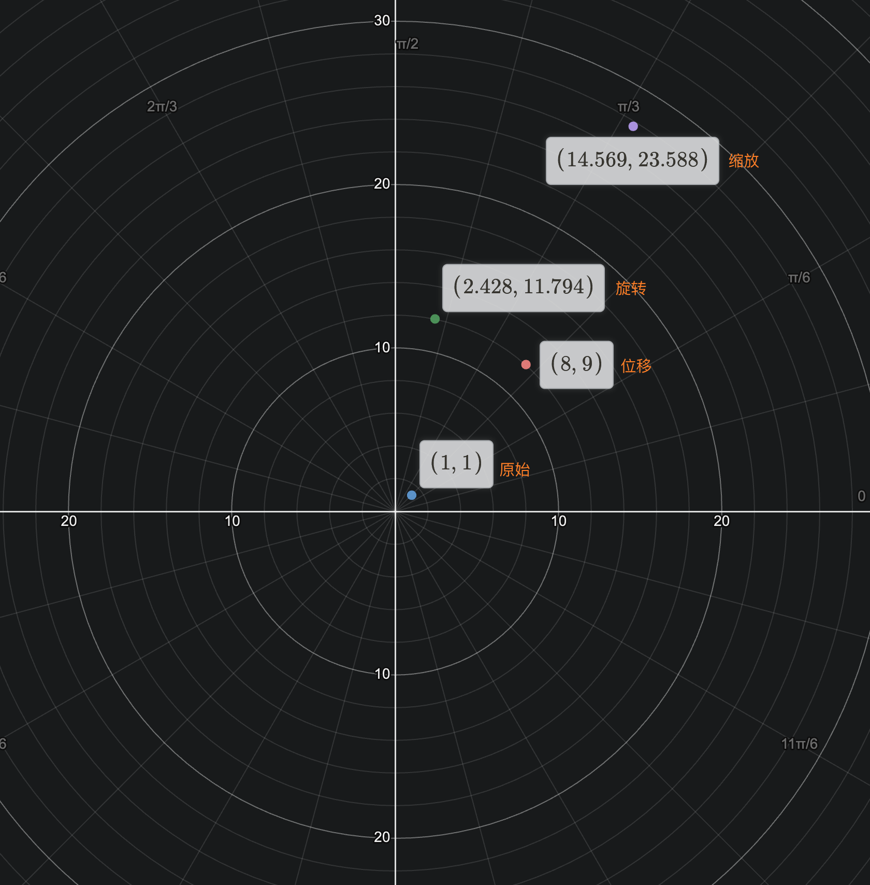
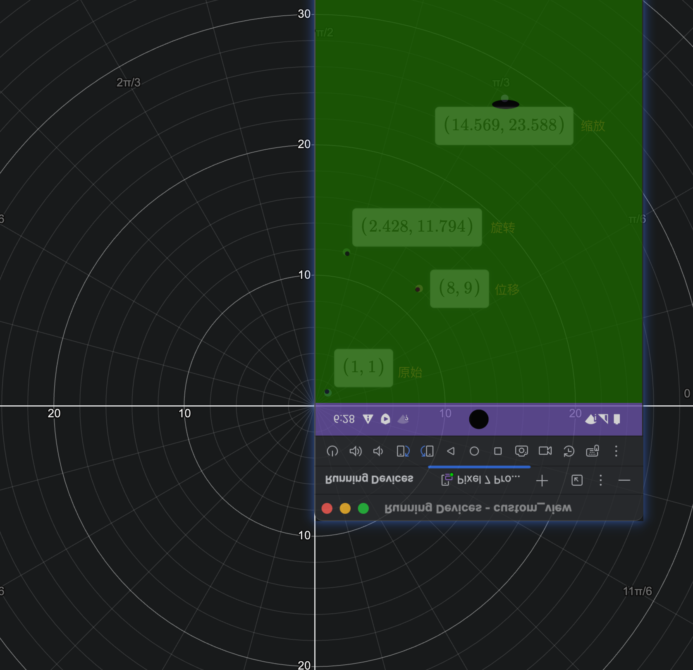
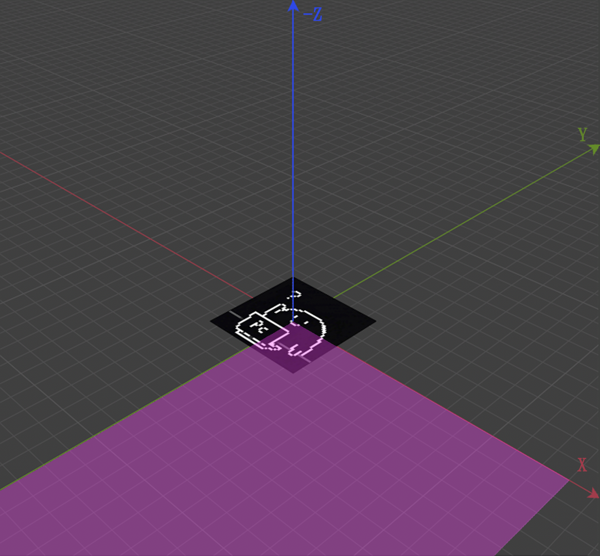
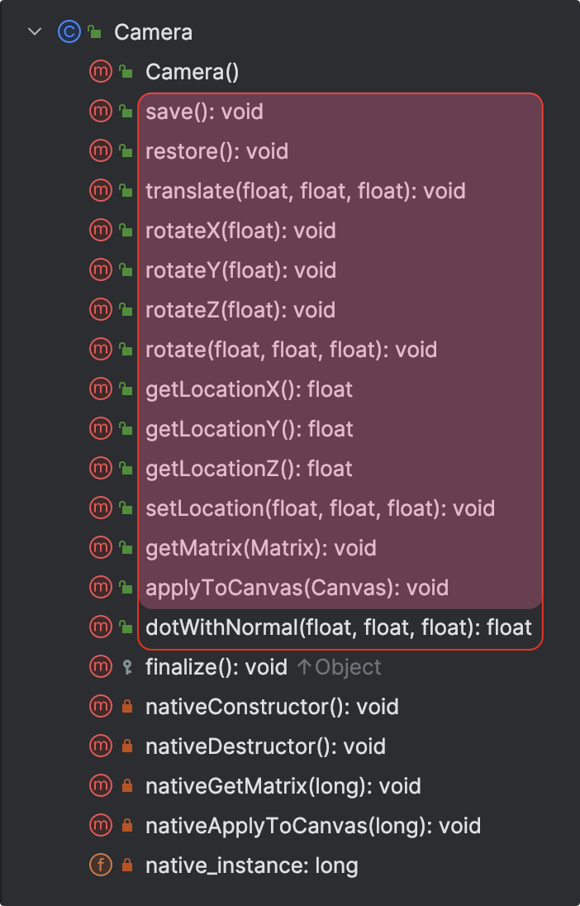
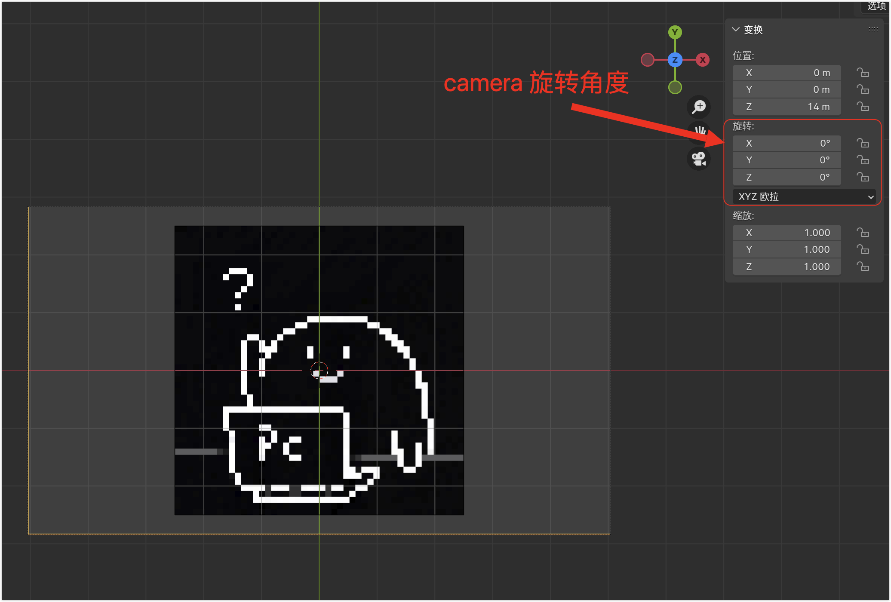
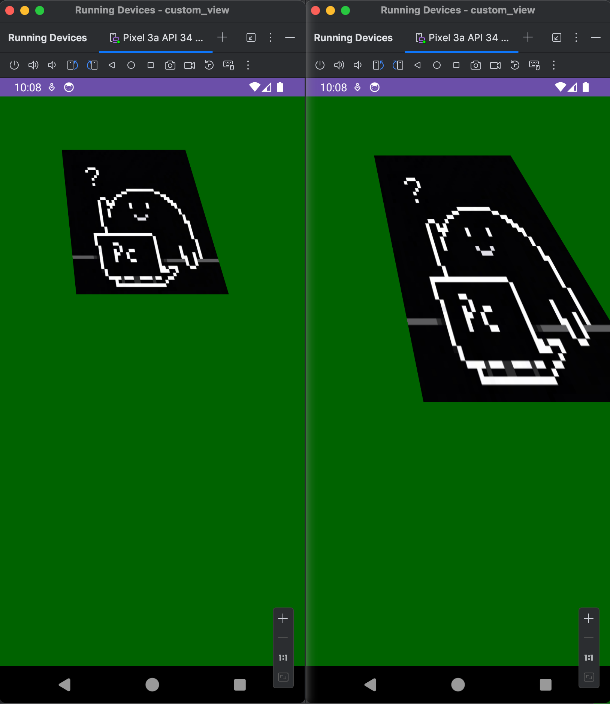
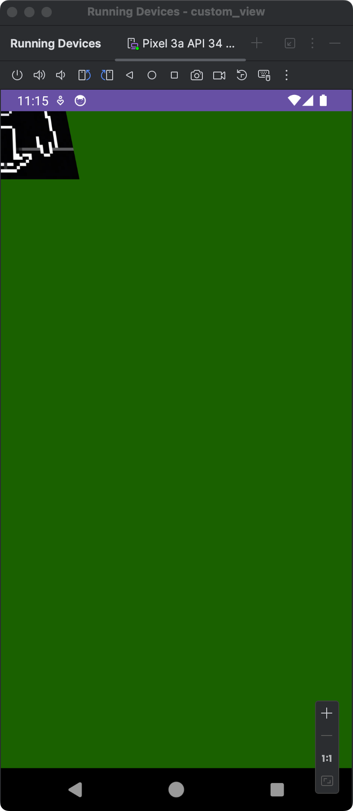
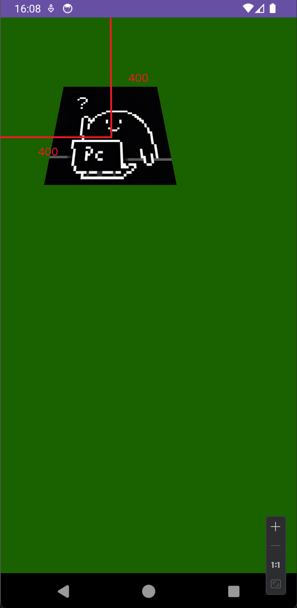

## 概述

Android 坐标系都是以左上角为原点，并且 view、canvas、Camera 是一个独立的坐标系

所以在进行绘制的时候，比如：自定义 Drawable 或者自定义 View，该如何去思考这个绘制流程呢？

如过你看过扔物线的视频或者文章，又或者在网上搜索过，一定知道 “倒着写绘制流程” 这种方法，但为什么要倒着写呢？？？

今天我来讲解更详细的内部原理

## 原理

原理就是，Android 里面使用的都是 **列矩阵右乘**

也就是说，你需要反着写绘制流程才会正常的矩阵变换流程

本文内容需要对矩阵的左乘右乘有一定的理解，比如列矩阵左乘是对被乘物体的变换。

这些知识应该是很容易就可以在网上搜索到的，如果你之前已经了解了一些，那往下看也许会帮你回想起来一些

### 左乘

按理说，如果我们想要对一个坐标系里的物体进行变换，如果我们使用的是列向量，我们应该用变换矩阵左乘它

比如我们有一个向量 A

对它进行变换，比如位移，我们会这样
$$
matrixTranslate \cdot A
$$
然后我们再对它进行旋转
$$
    matrixRotate \cdot matrixTranslate \cdot A
$$
最后我们对它进行缩放
$$
    matrixScale \cdot matrixRotate \cdot matrixTranslate \cdot A
$$

我们用代码模拟一下，使用我写的一个小工具

```kotlin
implementation("io.github.darkflamemasterdev:MatrixKotlin:1.1.1")
```

```kotlin
// 3行1列 的 1维列向量
val a = Matrix(
  3, 1,
  1f,
  1f,
  1f
)

// 3行3列 的 位移矩阵
val matrixTranslate = Matrix(
  3, 3,
  1f, 0f, 7f,
  0f, 1f, 8f,
  0f, 0f, 1f
)

// 3行3列 的 旋转矩阵（绕 0 点）
val matrixRotate = Matrix(
  3, 3,
  0.8660254f, -0.5f, 0f,
  0.5f, 0.8660254f, 0f,
  0f, 0f, 1f
)

// 3行3列 的 缩放矩阵
val matrixScale = Matrix(
  3, 3,
  6f, 0f, 0f,
  0f, 2f, 0f,
  0f, 0f, 1f
)
println(matrixTranslate * a)
println(matrixRotate * matrixTranslate * a)
println(matrixScale * matrixRotate * matrixTranslate * a)
```

```shell
{[8.0],[9.0],[1.0]}
{[2.428203],[11.7942295],[1.0]}
{[14.569218],[23.588459],[1.0]}
```

我们来看结果，这里使用的是 [desmos](www.desmos.com)



可以看到，矩阵左乘会让一个列向量按我们写的顺序进行变换

### 右乘

我们把这个情况在 Android 上复现（为了更明显，我们以 50px 是单位 1）

当然，由于 Android 是右乘，我们需要倒着写，也就是先缩放，再旋转，最后位移

```kotlin
override fun onDraw(canvas: Canvas) {
  canvas.drawCircle(50f, 50f, 10f, paint)

  canvas.save()
  canvas.translate(400f, 450f)
  canvas.drawCircle(50f, 50f, 10f, paint)
  canvas.restore()

  canvas.save()
  canvas.rotate(30f)
  canvas.translate(400f, 450f)
  canvas.drawCircle(50f, 50f, 10f, paint)
  canvas.restore()

  canvas.scale(6f, 2f)
  canvas.rotate(30f)
  canvas.translate(400f, 450f)
  canvas.drawCircle(50f, 50f, 10f, paint)
}
```


我们把两个坐标系对比一下：



而对于 Matrix ，右乘就是 `Matrix.post...` ， 而 `Matrix.pre...` 则是左乘，这个下面还会提到

### 坐标系

只进行 translate rotate clip skew scale 等系统预设的变换，我称之为 简单变换

我们拿自定义 View 举例，在进行 canvas 绘制的时候，canvas 本身的坐标是和 View坐标独立的，也就是说 canvas 和 View 分别有自己的坐标


举个例子，蓝色为 View 坐标系，绿色为 Canvas 坐标系

```kotlin
override fun onDraw(canvas: Canvas) {
  canvas.translate(200f,100f)
  canvas.drawBitmap(bitmap, 0f, 0f, paint)
}
```

如图所示，这是先将画布平移，然后绘制在画布的 (0, 0) 的位置

也就是说，`canvas.translate()` 函数并不是改变了绘制的位置，而是改变了画布 canvas 的位置

### 3d 渲染（Matrix、Camera）

Matrix 可以实现几乎任何变换，包括 2d 或者 3d 渲染，而 Camera 本质也是计算出 Matrix 来实现 3d 变换

### Matrix

#### Matrix 是什么

这里说的是 `android.graphics.Matrix` 而不是 `android.opengl.Matrix`

> 是的,每次我都想吐槽,只说这个类名而不说包名，然后遇到重名是真的抓狂

我们先看这个 Matrix 到底是什么！

```kotlin
log("matrix = $matrix")
```

```logcat
matrix = Matrix{[1.0, 0.0, 0.0][0.0, 1.0, 0.0][0.0, 0.0, 1.0]}
```

这里我们调用 Matrix.toString() ，发现打印出来确实是一个矩阵，我们再看看他的 toString 是怎么写的

```java
@Override
public String toString() {
    StringBuilder sb = new StringBuilder(64);
    sb.append("Matrix{");
    toShortString(sb);
    sb.append('}');
    return sb.toString();
}

private void toShortString(StringBuilder sb) {
    float[] values = new float[9];
    getValues(values);
    sb.append('[');
    sb.append(values[0]);
    sb.append(", ");
    sb.append(values[1]);
    sb.append(", ");
    sb.append(values[2]);
    sb.append("][");
    sb.append(values[3]);
    sb.append(", ");
    sb.append(values[4]);
    sb.append(", ");
    sb.append(values[5]);
    sb.append("][");
    sb.append(values[6]);
    sb.append(", ");
    sb.append(values[7]);
    sb.append(", ");
    sb.append(values[8]);
    sb.append(']');
}

public void getValues(float[] values) {
    if (values.length < 9) {
        throw new ArrayIndexOutOfBoundsException();
    }
    nGetValues(native_instance, values);
}

@FastNative
private static native void nGetValues(long nObject, float[] values);
```

可以看到，这里其实就是调用了 nGetValues 这个 native 方法来填充 values，然后通过 StringBuilder 将他们连接起来

而这个 values 其实就是关键性起作用的变量，但如果你看过 Java 层面的源码，你就知道，values 出现最多的就是 setValues 、 getValues 和 toString 里面，其他地方根本每调用过这个变量

也就是说，这个变量的计算逻辑被完全封装到的 C++ 层了，在我们调用 `preRotate` ， `postRotate` ， `setSinCos` ...... 这些方法的时候，他会在 C++ 层为我们计算好 Matrix ，然后在我们调用 `canvas.concat(matrix)` 或者 `canvas.setMatrix()` 的时候，将计算好的 Matrix 应用到 Canvas

pre 对应矩阵左乘，而 post 对应矩阵右乘

Android 这么做的目的显而易见，是为了让我们不要过多关心矩阵运算，只通过他提供的一些方法，来完成绘制

值得一提的是

`canvas.setMatrix()` 这个方法并不好用，经常有人抱怨这个方法会出现奇奇怪怪的问题，但我还没遇到过，所以你可以优先使用 `canvas.concat(matrix)`

`canvas.concat(matrix)` 是将 Matrix 和 Canvas 进行组合计算，而 `canvas.setMatrix()` 则是直接替换 Canvas 的矩阵

那这个 concat 函数是如何进行矩阵操作的呢？我试验一下

```kotlin
override fun onDraw(canvas: Canvas) {
  canvasMatrix.setValues(floatArrayOf(2f, 4f, 3f, 8f, 5f, 9f, 2f, 5f, 7f))
  cameraMatrix.setValues(floatArrayOf(-6f, 2f, 1f, 9f, 6f, -3f, 6f, 3f, 3f))
  canvas.setMatrix(canvasMatrix)
  canvas.concat(cameraMatrix)
  log("canvas.matrix = ${canvas.matrix}")
}
```

```shell
Matrix{[42.0, 37.0, -1.0][51.0, 73.0, 20.0][75.0, 55.0, 8.0]}
```

我们猜测应该也是右乘的关系 也就是 $canvasMatrix \cdot cameraMatrix$

```kotlin
// 使用implementation("io.github.darkflamemasterdev:MatrixKotlin:1.1.1")

val canvasMatrix = Matrix(3, 3).apply {
  setMatrixValue(
    arrayOf(
      floatArrayOf(2f, 4f, 3f),
      floatArrayOf(8f, 5f, 9f),
      floatArrayOf(2f, 5f, 7f)
    )
  )
}
val cameraMatrix = Matrix(3, 3).apply {
  setMatrixValue(
    arrayOf(
      floatArrayOf(-6f, 2f, 1f),
      floatArrayOf(9f, 6f, -3f),
      floatArrayOf(6f, 3f, 3f)
    )
  )
}
val x = canvasMatrix * cameraMatrix
println(x)
```

```shell
{[42.0, 37.0, -1.0][51.0, 73.0, 20.0][75.0, 55.0, 8.0]}
```

果然和我们想的一模一样

### Camera

#### Camera 模型

Camera 类似于 3d 软件里的模型，如果你使用过类似 Blender 之类的软件一定非常好理解

而 Camera 本质还是通过建立这样的 3d 模型计算出一个 Matrix



这是 Camera 的坐标系，除了 X 轴，其他的都是和 View 坐标轴相反的

我们打开 Camera 这个类，发现很短，就只有短短 171 行



方法也只有位移和旋转而已，所以相机这个模型就是为了解决投影的倾斜对应的矩阵计算的

dotwithNormal 这个方法在 Google 的 Api 文档里也没有任何解释，调用它我也没有发现产生任何作用，所以我们暂时不去考虑它

其中有一个 getMatrix 的方法

```java
// android.graphics.Camera

public void getMatrix(Matrix matrix) {
    nativeGetMatrix(matrix.ni());
}
```

你可以传进去一个空的 Matrix 对象，然后 Camera 的信息会被复制进你传入的这个函数里

所以你有理由怀疑，所有的自定义 View 变换都是通过矩阵变换计算来的，当然我也是这样想的...大概吧

我们用 blender 模拟一下这样的摄像机模型，图片长 5 宽 5，摄像机距图片 14


当摄像头默认在正上方，不旋转的时候，是这样的




上图是摄像机旋转 45 度的样子

#### Location

我们先查看一下这个摄像机的默认设置，主要就是这个摄像机的位置信息

```kotlin
override fun onDraw(canvas: Canvas) {
  log("camera.locationX = ${camera.locationX}")
  log("camera.locationY = ${camera.locationY}")
  log("camera.locationZ = ${camera.locationZ}")
  camera.applyToCanvas(canvas)
}
```

```shell
camera.locationX = 0.0
camera.locationY = 0.0
camera.locationZ = -8.0
```

可以看到默认 X 是 0.0 ，Y 是 0.0 , Z 是 -8.0

值得注意的的是，只是调用 Camera 的 setLocation 并不会改变绘制主体的大小，而是会改变绘制主体的位置

```kotlin
// Bitmap 长宽均为 400
  private val padding = 200f
  private val camera by lazy {
    Camera().apply {
      setLocation(4f, 20f, -72f)
    }
  }

  private var matrix = Matrix()

  override fun onDraw(canvas: Canvas) {
    camera.getMatrix(matrix)
    log("matrix = $matrix")
    camera.applyToCanvas(canvas)
    canvas.drawBitmap(bitmap, padding, padding, paint)
  }
```

```shell
matrix = Matrix{[1.0, 0.0, -288.0][0.0, 1.0, 1440.0][0.0, 0.0, 1.0]}
```

$$
  \begin{bmatrix}
    1 & 0 & -288\\
    0 & 1 & 144\\
    0 & 0 & 1
  \end{bmatrix}
$$

这里通过简单的线性代数知识就知道，这是一个位移矩阵，而主对角线全是 1 说明了这个矩阵并不存在任何缩放

为什么会是这个数字呢？

首先我们将相机向右上角移动，对应的投影出来的绘制主体自然会向左下角移动

按比例计算，向左平移 4×72 = 288px ， 向下平移 20×72=1440px

当我们在 Android 里调用 camera.setLocation() 的时候，里面填写的参数，单位是 inch（英寸） ，1 inch = 72 px，所以我们将这个 bitmap 设为宽高

#### Rotate

##### LocationZ 影响 Rotate

从现在开始，一定要牢记，camera 的原理是矩阵变换

```kotlin
// Bitmap 长宽均为 400
private val paint = Paint(Paint.ANTI_ALIAS_FLAG)
private val padding = 200f
private val camera by lazy {
  Camera().apply {
    rotateX(30f)
    setLocation(0f, 0f, -8)
    //setLocation(0f, 0f, -16)
  }
}

override fun onDraw(canvas: Canvas) {
  camera.applyToCanvas(canvas)
  canvas.drawBitmap(bitmap, padding, padding, paint)
}
```

我们让相机绕 X 轴旋转 30°，分别设置两个不同的 Z 轴值



左图是 LocationZ 为 -16，右图 Location 为 -8

可见，Location 虽然不会缩放，它会影响旋转的效果，这很容易理解，因为旋转的角度相同，距离越近，肯定效果越明显

我们将矩阵打印出来

```shell
LocationZ = -8, Matrix{[1.0, 0.0, 0.0][0.0, 0.8660254, 0.0][0.0, -8.6805556E-4, 1.0]}
LocationZ = -16, Matrix{[1.0, 0.0, 0.0][0.0, 0.8660254, 0.0][0.0, -4.3402778E-4, 1.0]}
LocationZ = -32, Matrix{[1.0, 0.0, 0.0][0.0, 0.8660254, 0.0][0.0, -2.1701389E-4, 1.0]}
```

可以发现，LocationZ 会直接影响下面这个值，并且是成比例的

对于这种效果我们是很难计算的，更多的我们是要进行更一些更有规律的变换效果，比如垂直翻转

##### 垂直翻转

由于，Camera 的原理是矩阵运算，并且其他操作包括 Canvas.translate 等操作都是矩阵运算，所以我们先执行最简单的翻转

```kotlin
// Bitmap 长宽均为 400
private val camera by lazy {
  Camera().apply {
    rotateX(30f)
    setLocation(0f, 0f, -8f)
  }
}

override fun onDraw(canvas: Canvas) {
  camera.applyToCanvas(canvas)
  canvas.drawBitmap(bitmap, -200f, -200f, paint)
}
```



我们该如何将这个图放到中间呢？（也就是向右下角移动）

##### 垂直翻转 + 平移

怎么才能让 Camera 计算出来的 Matrix 使得图形在任意位置垂直翻转呢？

我们可以将位移和相机的矩阵运算结合起来

1. 先将矩阵的绘制中心和相机的 x, y 位置对准
2. 然后进行相机的矩阵变换
3. 最后将图像移回原位

当然，我们得倒着写，因为 Android 里面使用的是列矩阵右乘

```kotlin
override fun onDraw(canvas: Canvas) {
  canvas.translate(200f, 200f) // Translate_1
  camera.applyToCanvas(canvas)
  canvas.translate(-200f, -200f) // Translate_2
  canvas.drawBitmap(bitmap, 0f, 0f, paint)
}
```

这个矩阵 $ Translate1\cdot cameraMatrix\cdot Translate2$

网上还有人提出了以下的做法，其实也是这个道理，只不过，将第一步的 `canvas.translate()` 变成了 `matrix.preTranslate()` 而已

这个矩阵也是这样的 $ Translate1\cdot cameraMatrix\cdot Translate2$

```kotlin
private var matrix = Matrix()
private val centerX = 400f
private val centerY = 400f

override fun onDraw(canvas: Canvas) {
  camera.getMatrix(matrix)

  matrix.preTranslate(-centerX, -centerY) // 先左乘 Translate_1
  matrix.postTranslate(centerX, centerY)  // 再右乘 Translate_2
  canvas.concat(matrix)
  canvas.drawBitmap(bitmap, 200f, 200f, paint)
}
```

~~有人说这个 centerX 和 centerY 是实际物体显示的中心位置~~

这句话是不对的！！！！！！

你依旧是按照第一个代码倒着写的原理就行

这个代码我们将位移的变量进行了修改，最终效果就是这样的


