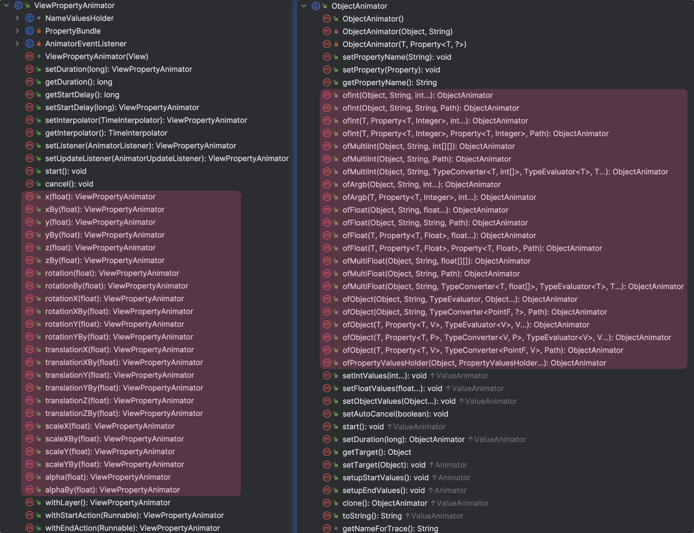
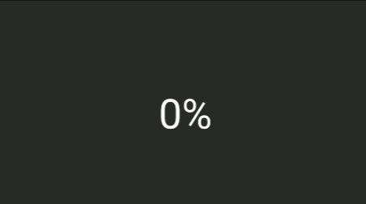

## 概述

这次的内容其实相比上篇要容易的多，只需要接触代码上的知识就好了

本文介绍的是 `ViewPropertyAnimator` 和 `ObjectAnimator`

## 应用场景

`ViewPropertyAnimator` 和 `ObjectAnimator` 原理都是使用了 `ValueAnimator`

`ViewPropertyAnimator` 是作为一个辅助类来调用 `ValueAnimator`

而 `ObjectAnimator` 则是继承了 `ValueAnimator` ，实现了更灵活的功能

下图就对比了两个类声明的不同函数，`ViewPropertyAnimator` 都是一些现成的变换（位移、旋转...），而 `ObjectAnimation` 则是侧重于你希望通过改变什么变量来控制动画（属于是面向对象的动画，非常符合 `ObjectAnimation` 的名字）



使用场景

[Android 官方文档](https://developer.android.com/reference/android/view/ViewPropertyAnimator) 里写到：If only one or two properties on a View object are being animated, then using an ObjectAnimator is fine; the property setters called by ObjectAnimator are well equipped to do the right thing to set the property and invalidate the view appropriately. But if several properties are animated simultaneously, or if you just want a more convenient syntax to animate a specific property, then ViewPropertyAnimator might be more well-suited to the task.

也就是，在你使用 1~2 个属性变换的时候，`ObjectAnimator` 是非常合适的，但属性多了会导致一些性能问题，这其实也很好理解，如果你了解过他的实现原理，就知道他其实是用反射，调用 `set/get` 方法并调用 `invalidate()` 重绘当前 `View` ，过多的重绘自然会影响性能

而 `ViewPropertyAnimator` 将这些做了优化，但灵活性下降了不少

但由于 `ObjectAnimation` 更加灵活，还是深受开发者喜爱

关于 `ViewPropertyAnimator` 的优化，我这里简单说一丢丢，拿这个简单代码为例

```kotlin
view.animate()
  .translationX(200f)
  .setInterpolator(LinearInterpolator())
  .setDuration(2000)
  .translationY(300f)
```

1. `view.animate()` 会构造一个 `ViewPropertyAnimator`
2. `translationX(200f)` 会将这个位移 200 的动画，保存到 `ValueAnimator` 里面，`post` 出去，而这个 post 就最终调用这个方法

   ```java
   private void animatePropertyBy(int constantName, float startValue, float byValue) {
       ...
       mPendingAnimations.add(nameValuePair);
       mView.removeCallbacks(mAnimationStarter);
       mView.postOnAnimation(mAnimationStarter);
   }
   ```

   `mPendingAnimations.add(nameValuePair)` 就是添加动画行为，`mPendingAnimations` 是一个 ArrayList

   而 `postOnAnimation` 这个方法就是下面这个方法

   ```java
   /**
    * <p>Causes the Runnable to execute on the next animation time step.
   * The runnable will be run on the user interface thread.</p>
   *
   * @param action The Runnable that will be executed.
   *
   * @see #postOnAnimationDelayed
   * @see #removeCallbacks
   */
   public void postOnAnimation(Runnable action) {
       final AttachInfo attachInfo = mAttachInfo;
       if (attachInfo != null) {
           attachInfo.mViewRootImpl.mChoreographer.postCallback(
                   Choreographer.CALLBACK_ANIMATION, action, null);
       } else {
           // Postpone the runnable until we know
           // on which thread it needs to run.
           getRunQueue().post(action);
       }
   }
   ```

   `getRunQueue()` 是一个 `HandlerActionQueue`

   看到这里应该就非常清晰了，本质就是把这个 `animator` 交由 `Handler` 处理
3. `setInterpolator(LinearInterpolator())` 和 `setDuration(2000)` 这都是设置动画参数
4. 最后还是，将动画保存下来 post 过去，但这里要注意一下 `removeCallbacks` 将上一个 `mAnimationStarter` 移除了，这达到了去重操作，这就是关键的优化操作

问题

那么有一个问题，我们先把动画 post 过去，再设置动画时长（`setDuration`），那这个动画是会在没给他设置动画时长的时候，启动吗？

肯定是没有这个问题的，因为这都是在主线程里，方法整体的调用栈会先执行完，再有可能执行其他的任务，也就是说，这个 `post` 过去的任务肯定是会在我们设置这些动画参数之后的，肯定不会出问题的

## 使用 ObjectAnimation

### 简单用法


