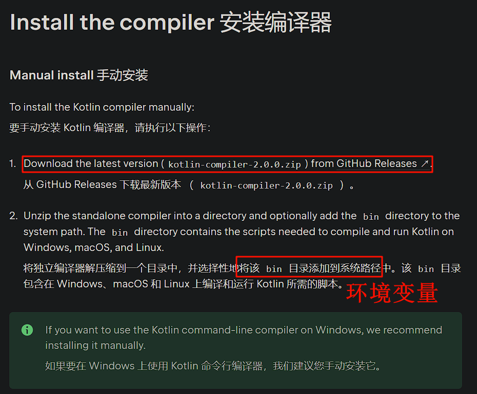
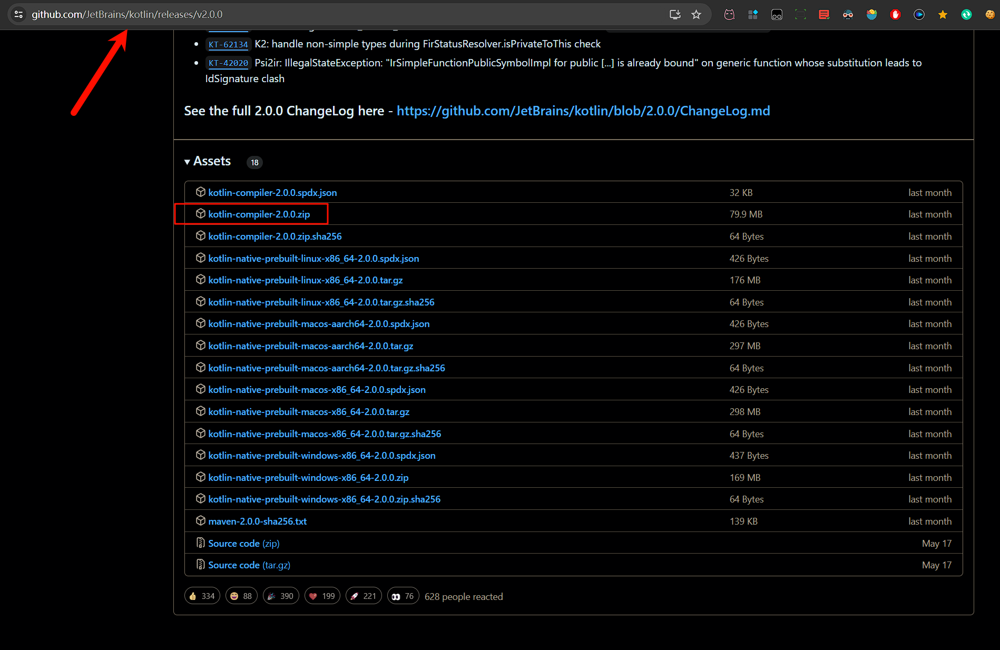
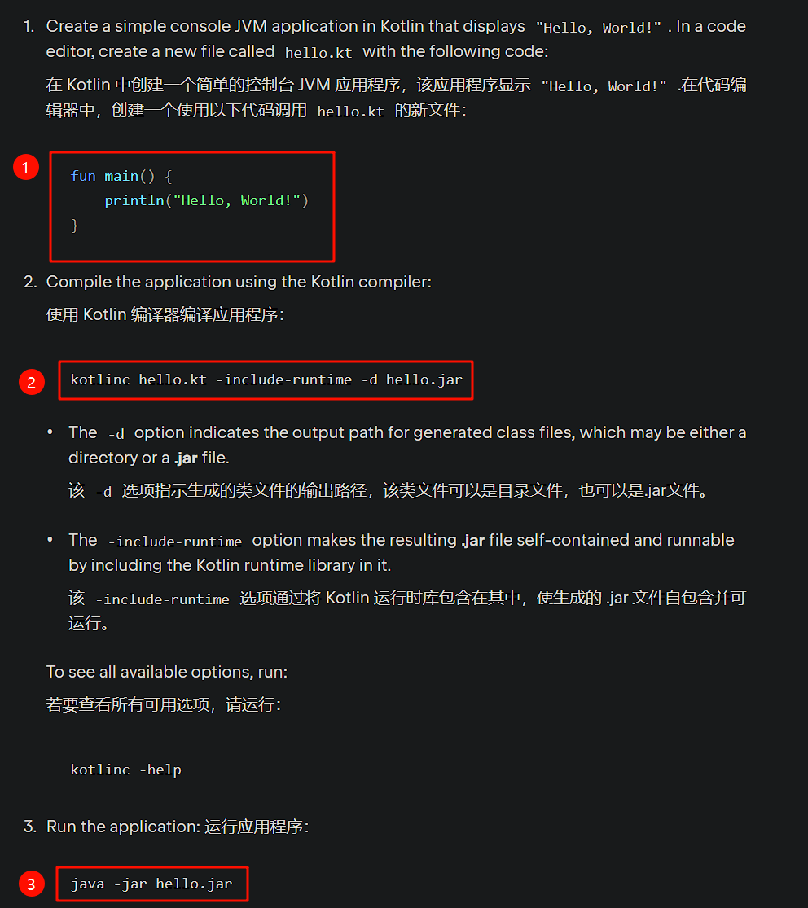
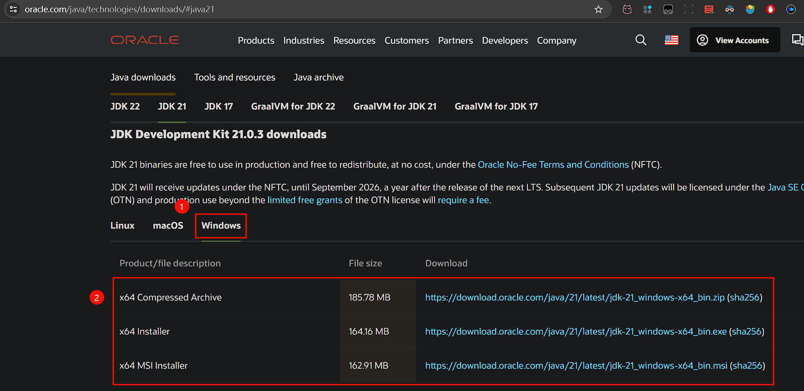
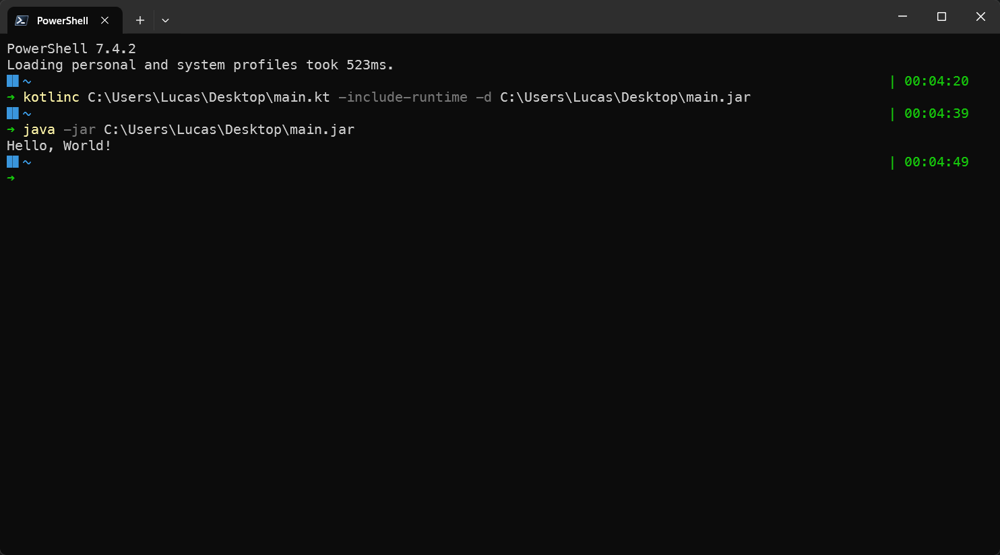

## 背景介绍

Kotlin 编译器 k2 出来了，就想着平时写 Kotlin 都是直接用的 IDEA 和 Android Studio ，并不是自己配置开发环境

这肯定是一个趋势，就是所有的开发环境配置项都i是点两下就配置好了，不用再去设置什么环境变量，非常地方便

但我还是想看看 Kotlin 是怎么编译运行的，以 JVM 为例，大概率是把 Kotlin 编译成 jar 包对吧，然后再调用 java 运行，我是这么猜的

## 阅读官网文档

[官网 教程](https://kotlinlang.org/docs/command-line.html#install-the-compiler) 

### 下载编译器

我们去 [GitHub](https://github.com/JetBrains/kotlin/releases/v2.0.0) 下载

### 安装Java

直接下载后解压，添加 bin 到系统环境变量里面，如果我i们这时候编译，会提示找不到 Java

我们看官网教程写着最终确实是编译成 jar 包了，那我们就需要安装 Java 了

我这里选择的是 Java 21 LTS 版本

记得配置环境变量，这个网上一搜一大把， Java 1.5 版本之后就不需要再配置 ClassPath 了

### 编译运行

然后我们 就可以编译运行了

## 结尾

如果你问我为啥不写 Kotlin 编译成 JavaScript 的教程

答：我不会。看样子、好像、大概是只能用 Kotlin multiplatform 来进行编译了，这是一个 Gradle 插件