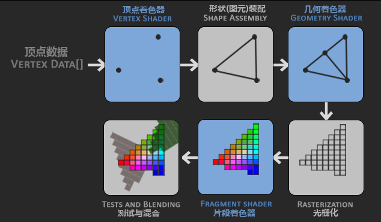
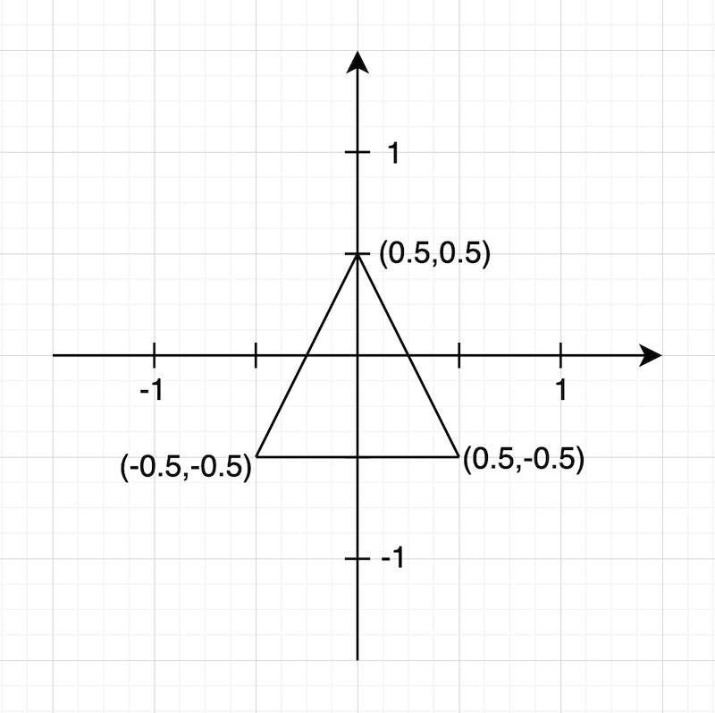
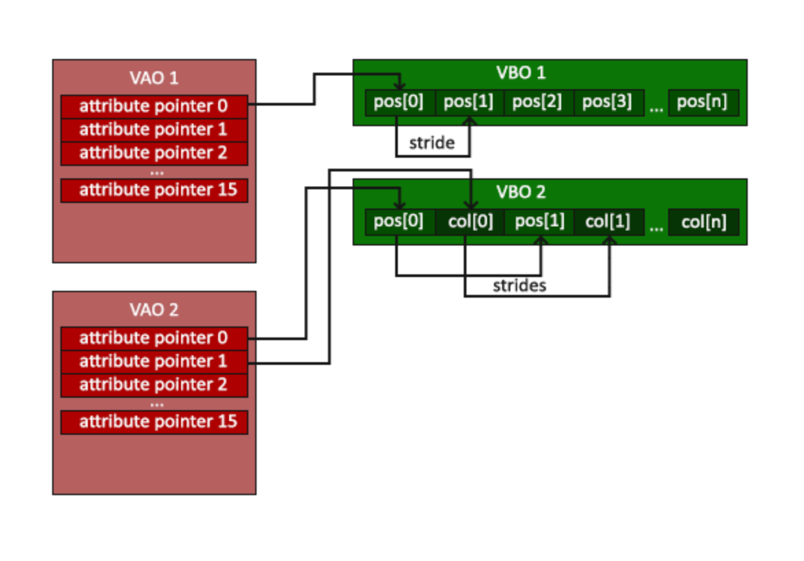

## 渲染管线



这是常见的渲染管线的图，每一步都以上一步的输出为输入，图形渲染管线接受一组3D坐标，然后把它们转变为你屏幕上的有色2D像素输出。

1. 图形渲染管线的第一个部分是顶点着色器(Vertex Shader)，它把一个单独的顶点作为输入。

   顶点着色器主要的目的是把3D坐标转为另一种3D坐标，同时顶点着色器允许我们对顶点属性进行一些基本处理。

2. 图元装配(Primitive Assembly)阶段将顶点着色器输出的所有顶点作为输入（如果是GL_POINTS，那么就是一个顶点），并所有的点装配成指定图元的形状；本节例子中是一个三角形。

3. 图元装配阶段的输出会传递给几何着色器(Geometry Shader)。几何着色器把图元形式的一系列顶点的集合作为输入，它可以通过产生新顶点构造出新的（或是其它的）图元来生成其他形状。例子中，它生成了另一个三角形。

4. 几何着色器的输出会被传入光栅化阶段(Rasterization Stage)，这里它会把图元映射为最终屏幕上相应的`像素`，生成供片段着色器(Fragment Shader)使用的`片段(Fragment)`。在片段着色器运行之前会执行`裁切(Clipping)`。裁切会丢弃超出你的视图以外的所有像素，用来提升执行效率。

   OpenGL中的一个片段是OpenGL渲染一个像素所需的所有数据。

5. 片段着色器的主要目的是`计算一个像素的最终颜色`，这也是所有OpenGL高级效果产生的地方。通常，片段着色器包含3D场景的数据（比如光照、阴影、光的颜色等等），这些数据可以被用来计算最终像素的颜色。

6. 在所有对应颜色值确定以后，最终的对象将会被传到最后一个阶段，我们叫做`Alpha测试和混合(Blending)阶段`。这个阶段检测片段的对应的深度（和模板(Stencil)）值，用它们来判断这个像素是其它物体的前面还是后面，决定是否应该丢弃。这个阶段也会检查`alpha值（alpha值定义了一个物体的透明度）`并对物体进行混合(Blend)。所以，即使在片段着色器中计算出来了一个像素输出的颜色，在渲染多个三角形的时候最后的像素颜色也可能完全不同。

## 看代码之前

看代码之前我们要明确怎么写

1. 我们要初始化我们使用的工具, 比如：glfw
2. 创建一个窗口，并为窗口注册事件监听，后面的绘制都在这个窗口上操作
3. 编译着色器
   - 编译顶点着色器
   - 编译片段着色器
4. 生成 program，链接着色器
5. 绑定 VAO，VBO，或者以后还可能有 EBO，并设置他们的参数
6. 循环中绘制图形

## 代码

`hello_triangle.h` 👇

```c++
#ifndef OPENGL_ENVIRONMENT_TEST_HELLO_TRIANGLE_H
#define OPENGL_ENVIRONMENT_TEST_HELLO_TRIANGLE_H

#include <string>

// GLAD is used to manage Open GL function pointers
#include <glad/glad.h>
#include <GLFW/glfw3.h>

#define WINDOW_WIDTH 800
#define WINDOW_HEIGHT 800
#define WINDOW_TITLE "lucas-opengl"
using namespace std;

class hello_triangle {

public:
    static int create_a_triangle();

private:
    static void draw_frame(unsigned int shaderProgram, unsigned int VAO);

    static void processInput(GLFWwindow *window);

    static void framebuffer_size_callback(GLFWwindow *window, int width, int height);

    static void init_glfw();

    static GLFWwindow *create_glfw_window();

    static void check_shader(unsigned int shader, const string &type);

    static void check_program(unsigned int shaderProgram);
};


#endif //OPENGL_ENVIRONMENT_TEST_HELLO_TRIANGLE_H

```

`hello_triangle.cpp` 👇

```c++
#include <iostream>

#include "hello_triangle.h"

int hello_triangle::create_a_triangle() {
    init_glfw();

    GLFWwindow *window = create_glfw_window();

    if (window == nullptr) {
        return -1;
    }

    // Set the context of our window to the main context of the current thread
    glfwMakeContextCurrent(window);

    // glfwGetProcAddress is the function GLFW get Open GL pointer
    // check if GLAD can use the glfw function in order to initialize GLAD
    if (!gladLoadGLLoader((GLADloadproc) glfwGetProcAddress)) {
        std::cout << "failed to initialize GLAD" << std::endl;
        glfwTerminate();
        return -1;
    }

    // 注册 framebuffer_size_callback
    glfwSetFramebufferSizeCallback(window, framebuffer_size_callback);


    // ********************* 编译着色器 ****************************


    const char *vertexShaderSource = "#version 330 core\n"
                                     "layout (location = 0) in vec3 aPos;\n"
                                     "void main(){\n"
                                     "   gl_Position = vec4(aPos.x, aPos.y, aPos.z, 1.0);\n"
                                     "}\0";

    const char *fragmentShaderSource = "#version 330 core\n"
                                       "out vec4 FragColor;\n"
                                       "void main(){\n"
                                       "    FragColor = vec4(1.0f, 0.5f, 0.2f, 1.0f);\n"
                                       "}\0";
    // vertex shader
    // create a shader
    unsigned int vertexShader = glCreateShader(GL_VERTEX_SHADER);
    glShaderSource(vertexShader, 1, &vertexShaderSource, nullptr);
    glCompileShader(vertexShader);

    // check if the vertexShader compiled successfully
    check_shader(vertexShader, "GL_VERTEX_SHADER");

    // fragment shader
    // create a shader
    unsigned int fragmentShader = glCreateShader(GL_FRAGMENT_SHADER);
    glShaderSource(fragmentShader, 1, &fragmentShaderSource, NULL);
    glCompileShader(fragmentShader);

    // check if the fragmentShader compiled successfully
    check_shader(fragmentShader, "GL_FRAGMENT_SHADER");

    // ********************* 链接着色器，编译 program ****************************
    unsigned int shaderProgram = glCreateProgram();
    glAttachShader(shaderProgram, vertexShader);
    glAttachShader(shaderProgram, fragmentShader);
    glLinkProgram(shaderProgram);

    // check if the program compiled successfully
    check_program(shaderProgram);

    // delete shader
    glDeleteShader(vertexShader);
    glDeleteShader(fragmentShader);

 // ********************************************************************************
 // bind the Vertex Array Object first, then bind and set vertex buffer(s), and then configure vertex attributes(s).
    
    float vertices[] = {
            -0.5f, -0.5f, 0.0f,
            0.5f, -0.5f, 0.0f,
            0.0f, 0.5f, 0.0f
    };

    unsigned int VAO, VBO;
    glGenVertexArrays(1, &VAO);
    glGenBuffers(1, &VBO);

    // 1.绑定 VAO
    glBindVertexArray(VAO);
    // 2.绑定 VBO
    glBindBuffer(GL_ARRAY_BUFFER, VBO);
    glBufferData(GL_ARRAY_BUFFER, sizeof(vertices), vertices, GL_STATIC_DRAW);
    // 3.设置 Attribute
    glVertexAttribPointer(0, 3, GL_FLOAT, GL_FALSE, 3 * sizeof(float), (void *) nullptr);
    glEnableVertexAttribArray(0);
    // ********************************************************************************

    // note that this is allowed, the call to glVertexAttribPointer registered VBO as the vertex attribute's bound vertex buffer object so afterward we can safely unbind
    glBindBuffer(GL_ARRAY_BUFFER, 0);

    // You can unbind the VAO afterward so other VAO calls won't accidentally modify this VAO, but this rarely happens. Modifying other
    // VAOs requires a call to glBindVertexArray , so we generally don't unbind VAOs (nor VBOs) when it's not directly necessary.
    glBindVertexArray(0);


    while (!glfwWindowShouldClose(window)) {
        processInput(window);
        draw_frame(shaderProgram, VAO);

        // 交换 Buffer
        glfwSwapBuffers(window);

        // glfwPollEvents函数检查有没有触发什么事件（比如键盘输入、鼠标移动等）、更新窗口状态，并调用对应的回调函数（可以通过回调方法手动设置）
        glfwPollEvents();
    }

    // 释放/删除之前的分配的所有资源
    glfwTerminate();
    return 0;
}


/**
 * initialize glfw
 */
void hello_triangle::init_glfw() {
    // glfw initialize
    glfwInit();

    // Use OpenGL 3.3 version

    glfwWindowHint(GLFW_CONTEXT_VERSION_MAJOR, 3);
    glfwWindowHint(GLFW_CONTEXT_VERSION_MINOR, 3);

    // GLFW use core profile
    glfwWindowHint(GLFW_OPENGL_PROFILE, GLFW_OPENGL_CORE_PROFILE);

    // MacOS specific code
    glfwWindowHint(GLFW_OPENGL_FORWARD_COMPAT, GL_TRUE);
}

/**
 * create_glfw_window and check
 */
GLFWwindow *hello_triangle::create_glfw_window() {
    // Create a windows
    GLFWwindow *window = glfwCreateWindow(WINDOW_WIDTH, WINDOW_HEIGHT, WINDOW_TITLE, nullptr, nullptr);

    // Check if the window is created successfully
    if (window == nullptr) {
        std::cout << "failed to create GLFW window" << std::endl;
        glfwTerminate();
    }
    return window;
}

/**
 * 回调函数，在窗口大小调整的时候，调整 ViewPort 的大小
 * @param window
 * @param width
 * @param height
 */
void hello_triangle::framebuffer_size_callback(GLFWwindow *window, int width, int height) {
    glViewport(0, 0, width, height);
}

/**
 * 检测是否有按键输入
 * 如果按下了 esc 就设置当前窗口应该退出
 * @param window
 */
void hello_triangle::processInput(GLFWwindow *window) {
    if (glfwGetKey(window, GLFW_KEY_ESCAPE) == GLFW_PRESS) {
        glfwSetWindowShouldClose(window, true);
    }
}

void hello_triangle::check_shader(unsigned int shader, const string &type) {
    int success;
    char infoLog[512];
    glGetShaderiv(shader, GL_COMPILE_STATUS, &success);
    if (!success) {
        glGetShaderInfoLog(shader, 512, NULL, infoLog);
        std::cout << "ERROR::SHADER:: " << type << " ::COMPILATION_FAILED\n" << infoLog << std::endl;
    }
}

void hello_triangle::check_program(unsigned int shaderProgram) {
    int success;
    char infoLog[512];
    glGetProgramiv(shaderProgram, GL_LINK_STATUS, &success);
    if (!success) {
        glGetProgramInfoLog(shaderProgram, 512, NULL, infoLog);
        cout << "ERROR::shaderProgram::COMPILATION_FAILED\n" << infoLog << endl;
    }
}


void hello_triangle::draw_frame(unsigned int shaderProgram, unsigned int VAO) {

    // 设置调用 clear 所使用的颜色
    glClearColor(0.2f, 0.3f, 0.3f, 1.0f);

    // 清空屏幕
    glClear(GL_COLOR_BUFFER_BIT);

    // draw our first triangle
    glUseProgram(shaderProgram);

    // seeing as we only have a single VAO there's no need to bind it every time, but we'll do so to keep things a bit more organized
    glBindVertexArray(VAO);
    glDrawArrays(GL_TRIANGLES, 0, 3);
    glBindVertexArray(0);
}
```

## 代码讲解

对比上次的代码，这次多了不少，除了一些代码结构的改动，剩下的主要是在于  

### 1. 编译着色器

`第 29 到 59 行`

这里是编译着色器

```C++
// ********************* 编译着色器 ****************************
const char *vertexShaderSource = "#version 330 core\n"
                                 "layout (location = 0) in vec3 aPos;\n"
                                 "void main(){\n"
                                 "   gl_Position = vec4(aPos.x, aPos.y, aPos.z, 1.0);\n"
                                 "}\0";

const char *fragmentShaderSource = "#version 330 core\n"
                                   "out vec4 FragColor;\n"
                                   "void main(){\n"
                                   "    FragColor = vec4(1.0f, 0.5f, 0.2f, 1.0f);\n"
                                   "}\0";
// vertex shader
// create a shader
unsigned int vertexShader = glCreateShader(GL_VERTEX_SHADER);
glShaderSource(vertexShader, 1, &vertexShaderSource, nullptr);
glCompileShader(vertexShader);

// check if the vertexShader compiled successfully
check_shader(vertexShader, "GL_VERTEX_SHADER");

// fragment shader
// create a shader
unsigned int fragmentShader = glCreateShader(GL_FRAGMENT_SHADER);
glShaderSource(fragmentShader, 1, &fragmentShaderSource, NULL);
glCompileShader(fragmentShader);

// check if the fragmentShader compiled successfully
check_shader(fragmentShader, "GL_FRAGMENT_SHADER");
```

这里定义了两个着色器源代码

#### 1.1 顶点着色器源码 GLSL

`layout (location = 0) in vec3 aPos;`

这里是 `in` 代表输入，类型是 vec3 ，含有 3 个值的向量，同时设置了 `location=0` 的位置值

`gl_position` 为输出，是一种图元类型，类型为 vec4 ，四个分量分别是 gl_position.x , gl_position.y , gl_position.z , gl_position.w ，xyz 是坐标量，w 是到相机的距离（这个以后再研究）

vec 最多有 4 个分量，通过后缀可以看出来

#### 1.2 片段着色器源码 GLSL

`out vec4 FragColor`

`out` 代表输出，`FragColor` 类型是 vec4，四个分量分别是 red , green , blue , alpha(透明度)

每个值的范围都是 0-1，float

#### 1.3 编译操作

我们先调用`glCreateShader(GL_VERTEX_SHADER)` 创建一个`GL_VERTEX_SHADER`类型的着色器，并返回句柄

在调用`glShaderSource`来指定着色器源代码

```C++
void glShaderSource(GLuint shader, GLsizei count, const GLchar **string, const GLint *length);
```

这个函数帮我们把多个字符串拼接成一整个源代码，以便编译

> 这个函数有四个参数，第一个是我们上一行创建的 `shader` 的句柄，第二个是字符串的数量（因为有可能我们会编译多个 `shader`，如果这些 `shader`的某些源代码是一样的，我们就可以将这部分写成共用的，减少字符串冗余），第三个是字符串数组的起始指针（也就是数组的起始地址，如果只有一个字符串，只需传入这个字符串的首地址即可），最后一个是结束编译源代码的结束标志（这里也是一个指针类型，要求传入一个长度为第二个参数`count`的整形数组，为了给每个字符串设置长度限制，如果整形数组里有负数，对应字符串以空字符为结束标志，如果这里直接传入 `NULL` 那么所有字符串都以空字符为结束标志）

`glCompileShader`就是编译源代码的过程，我们可以通过 `glGetShaderiv` 来检查是否编译成功

> ps : 片段着色器创建的时候，和顶点着色器填写的类型不同，为 `GL_FRAGMENT_SHADER`

### 2. 生成 program，链接着色器

`第 61 到 72 行`

```C++
unsigned int shaderProgram = glCreateProgram();
glAttachShader(shaderProgram, vertexShader);
glAttachShader(shaderProgram, fragmentShader);
glLinkProgram(shaderProgram);

// check if the program compiled successfully
check_program(shaderProgram);

// delete shader
glDeleteShader(vertexShader);
glDeleteShader(fragmentShader);
```

这里我们需要将编译好的着色器链接到一个可执行的程序，以便后续一键执行

这里和上面是一样的，我们需要调用一个 `create` 函数，来创建一个 `program` ，并拿到他的句柄

`glAttachShader` 是用来着色器附到 `program` 上面

`glLinkProgram` 是用来将他们链接起来，这步操作会生成着色器对应的可执行文件

同样我们可以使用 `glGetProgramiv` 来检验是否链接成功

然后，我们链接成功了，编译好的 `Shader` 就没用了，可以直接删除了

直接调用 `glDelete` 将它删除

### 3. VAO 和 VBO

- 顶点数组对象：`Vertex Array Object，VAO`

  `VAO` 存储顶点属性（vertex attributes）的调用，这个有点抽象，我们后面详细讲解。

- 顶点缓冲对象：`Vertex Buffer Object，VBO`

  `VBO` 存储顶点本身，是为了一次性向 `GPU` 传输大量顶点，因为从 `CPU` 往 `GPU` 发送数据是相对慢的。

`第 74 到 102 行`

```C++
// ********************************************************************************
// bind the Vertex Array Object first, then bind and set vertex buffer(s), and then configure vertex attributes(s).

float vertices[] = {
        -0.5f, -0.5f, 0.0f,
        0.5f, -0.5f, 0.0f,
        0.0f, 0.5f, 0.0f
};

unsigned int VAO, VBO;
glGenVertexArrays(1, &VAO);
glGenBuffers(1, &VBO);

// 1.绑定 VAO
glBindVertexArray(VAO);
// 2.绑定 VBO
glBindBuffer(GL_ARRAY_BUFFER, VBO);
glBufferData(GL_ARRAY_BUFFER, sizeof(vertices), vertices, GL_STATIC_DRAW);
// 3.设置 Attribute
glVertexAttribPointer(0, 3, GL_FLOAT, GL_FALSE, 3 * sizeof(float), (void *) nullptr);
glEnableVertexAttribArray(0);
// ********************************************************************************

// note that this is allowed, the call to glVertexAttribPointer registered VBO as the vertex attribute's bound vertex buffer object so afterward we can safely unbind
glBindBuffer(GL_ARRAY_BUFFER, 0);

// You can unbind the VAO afterward so other VAO calls won't accidentally modify this VAO, but this rarely happens. Modifying other
// VAOs requires a call to glBindVertexArray , so we generally don't unbind VAOs (nor VBOs) when it's not directly necessary.
glBindVertexArray(0);
```

这里定义了 `vertices` 也就是顶点，为了说明三角形的位置

```c++
float vertices[] = {
     -0.5f, -0.5f, 0.0f,
     0.5f, -0.5f, 0.0f,
     0.0f, 0.5f, 0.0f
 };
```

这里是 3D 坐标，所以最后一个都是 0  

图形大概长这样



#### 3.1 VBO 和 顶点缓冲对象

```C++
// 绑定 VBO
glBindBuffer(GL_ARRAY_BUFFER, VBO);
glBufferData(GL_ARRAY_BUFFER, sizeof(vertices), vertices, GL_STATIC_DRAW);
```

`glBind`来绑定 `VAO` 和 `VBO`

`glBufferData` 会把之前定义的顶点数据复制到缓冲的内存中，所以这个函数只能在绑定了 VBO 之后调用

```C++
/**
 * 它的第一个参数是目标缓冲的类型：顶点缓冲对象当前绑定到GL_ARRAY_BUFFER目标上。
 * 第二个参数指定传输数据的大小(以字节为单位)；用一个简单的`sizeof`计算出顶点数据大小就行。
 * 第三个参数是我们希望发送的实际数据。
 * 第四个参数指定了我们希望显卡如何管理给定的数据。它有三种形式：
 * - GL_STATIC_DRAW ：数据不会或几乎不会改变。
 * - GL_DYNAMIC_DRAW：数据会被改变很多。
 * - GL_STREAM_DRAW ：数据每次绘制时都会改变。
 * 
 * 三角形的位置数据不会改变，每次渲染调用时都保持原样，所以它的使用类型最好是GL_STATIC_DRAW。
 * 如果，比如说一个缓冲中的数据将频繁被改变，那么使用的类型就是GL_DYNAMIC_DRAW或GL_STREAM_DRAW，这样就能确保显卡把数据放在能够高速写入的内存部分。
*/
void glBufferData(GLenum target, GLsizeiptr size, const GLvoid * data, GLenum usage);
```

#### 3.2 VAO 和 顶点属性

```c++
// 绑定 VAO
glBindVertexArray(VAO);
```

我们之前说的了—— `VAO` 存储顶点属性（vertex attributes）的调用，我们使用 [learn-opengl](https://learnopengl-cn.github.io/01%20Getting%20started/04%20Hello%20Triangle/#_2) 的图来解释一下



可以看到 `VAO` 里面都是 `pointer` ，我们将一开始写的那个 `float` 数组存放在 `VBO` 里面，然后调用 `glVertexAttribPointer` 进行设置属性调用指针（从函数名里的 `pointer` 就能看出来）

接下来我们来看这个 `glVertexAttribPointer` 函数：

```C++
glVertexAttribPointer(0, 3, GL_FLOAT, GL_FALSE, 3 * sizeof(float), (void *) nullptr);
glEnableVertexAttribArray(0);
```

```C++
/**
 * index : 指定要修改的通用顶点属性的索引，还记得我们一开始 vertices 里填写的 location 吗，就是这个数。
 * size : 指定每个顶点属性的向量大小。，就个属性一次读取几个数，vec3类型 就填写 3 就行。
 * type : 指定数组中每个组件的数据类型，直接填写 GL_FLOAT。
 * normalized : 是否标准化，填写 GL_TRUE 会让显卡帮我们把点映射到 0~1 之间（因为这里我们写的是 unsigned），如果我们写的是有符号的数，则会被限制在 -1~1 之间，
 * 所以我们这里填写 GL_FALSE
 * stride : 步长（步幅），指定连续通顶点属性之间的字节偏移量。显然我们下一组顶点数据在 3 个 float 之后，所以我们直接 sizeof 3 个 float
 * pointer : 这里是位置数据偏移量，就是开始读取的位置，由于是从头开始，我们可以直接写 0（C++ 新标准 写的是 nullptr）
 */
glVertexAttribPointer(GLuint index, GLint size, GLenum type, GLboolean normalized, GLsizei stride, const void *pointer)
```

这样我们的顶点属性就设置好了，最后调用一句 `glEnableVertexAttribArray(0);` 让这个 `location` 为 `0` 的定点生效（激活）

> 每个顶点属性从一个`VBO`管理的内存中获得它的数据，而具体是从哪个`VBO`（程序中可以有多个`VBO`）
>
> 获取则是通过在调用`glVertexAttribPointer`时绑定到`GL_ARRAY_BUFFER`的VBO决定的。
>
> 由于在调用`glVertexAttribPointer`之前绑定的是先前定义的`VBO`对象，顶点属性`0`现在会链接到它的顶点数据。

#### 3.3 解绑

```C++
glBindBuffer(GL_ARRAY_BUFFER, 0);
glBindVertexArray(0);
```

然后我们就可以解绑 `VAO` 和 `VBO` 了，可以看到，我们希望 `VAO` 和 `VBO` 对应起来，就需要绑定并设置他们，然后再解绑

在后面我们需要调用 VAO 来绘制的时候，也是这样

绑定 -> 操作 -> 解绑

只不过这是只有一个 `VAO` ，没有切换到其他 `VAO` 的需求，所以我们没必要不断绑定再解绑，但如果写了解绑其实更加标准，更加完整。

### 4. 开始绘制

```C++
while (!glfwWindowShouldClose(window)) {
    processInput(window);
    draw_frame(shaderProgram, VAO);

    // 交换 Buffer
    glfwSwapBuffers(window);

    // glfwPollEvents函数检查有没有触发什么事件（比如键盘输入、鼠标移动等）、更新窗口状态，并调用对应的回调函数（可以通过回调方法手动设置）
    glfwPollEvents();
}

// 释放/删除之前的分配的所有资源
glfwTerminate();
```

这里我们用一个循环不断执行绘制流程，这个上篇文章就讲过，我们这里尤其讲一下这个 `draw_frame`

```C++
void hello_triangle::draw_frame(unsigned int shaderProgram, unsigned int VAO) {

    // 设置调用 clear 所使用的颜色
    glClearColor(0.2f, 0.3f, 0.3f, 1.0f);

    // 清空屏幕
    glClear(GL_COLOR_BUFFER_BIT);

    // draw our first triangle
    glUseProgram(shaderProgram);

    // seeing as we only have a single VAO there's no need to bind it every time, but we'll do so to keep things a bit more organized
    glBindVertexArray(VAO);
    glDrawArrays(GL_TRIANGLES, 0, 3);
    glBindVertexArray(0);
}
```

我们这里中看下最后四行代码

```C++
// draw our first triangle
glUseProgram(shaderProgram);

// seeing as we only have a single VAO there's no need to bind it every time, but we'll do so to keep things a bit more organized
glBindVertexArray(VAO);
glDrawArrays(GL_TRIANGLES, 0, 3);
glBindVertexArray(0);
```

可以看到在调用了 `glUseProgram` 之后，和之前说的一样，绑定 -> 绘制 -> 解绑

```C++
/**
 * mode : 渲染的图元类型，我们这里指定的是 GL_TRIANGLES（三角形）
 * first : 起始索引
 * count : 一共绘制几个顶点
 */
void glDrawArrays(GLenum mode, GLint first, GLsizei count);
```

到这里，三角形应该就会出现在你的屏幕上了


开始欢呼吧！！！🎉🎉🎉
