# 万向节死锁

## 关键点

理解万向节死锁的关键就在于理解为什么会前面旋转会带动后面坐标轴一起进行旋转

## 欧拉角

我们设置三个旋转方向，分别为绕 x 轴，绕 y 轴，绕 z 轴 旋转，这就是欧拉角，以数学家欧拉的名字命名

请注意，我很还必须指定先绕着谁旋转，因为旋转的先后次序不一样，最终结果也就不一样

写成矩阵就是这个样子： $R_z\cdot R_y\cdot R_x\cdot V$ 

进行欧拉角变换的时候，要始终保持这个变换顺序，不可随意删除改变任何矩阵

### 举个例子

通常举的例子是：

我们以飞机的机头方向向量代表飞机本身

我们定义旋转顺序为 x、y、z 

我们先让飞机绕 y 轴旋转 90° ，此时会带动 z 轴一起旋转，z 轴与 x 轴重合，导致旋转 z 轴和 x 轴效果一样（蓝色是 $z$ 轴，红色是 $x$​​ 轴）

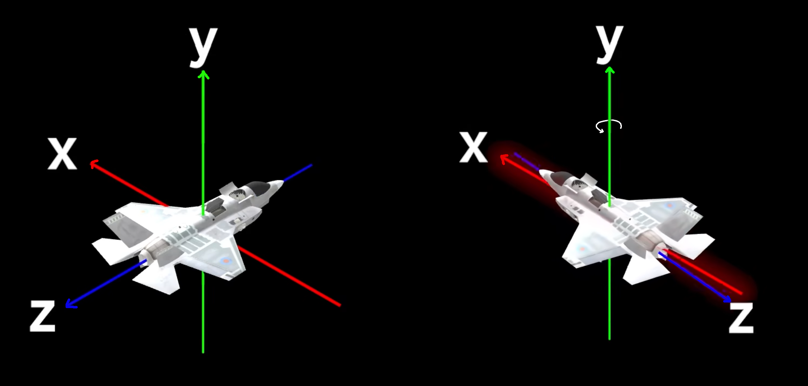

我们用矩阵把他表示出来
$$
R_y = 
\begin{bmatrix}
cos90° & 0 & sin90° \\
0 & 1 & 0 \\
-sin90° & 0 & cos90°
\end{bmatrix}
=
\begin{bmatrix}
0 & 0 & 1 \\
0 & 1 & 0 \\
-1 & 0 & 0
\end{bmatrix}
$$
然后我们再定义一个绕 x 轴和绕 z 轴旋转 的矩阵
$$
R_x =
\begin{bmatrix}
1 & 0 & 0 \\
0 & cos\theta & -sin\theta \\
0 & sin\theta & cos\theta
\end{bmatrix}
$$

$$
R_z =
\begin{bmatrix}
cos\theta & -sin\theta & 0 \\
sin\theta & cos\theta & 0 \\
0 & 0 & 1
\end{bmatrix}
$$

我们计算 $R_x\cdot R_y = \begin{bmatrix} 0 & 0 & 1\\sin\theta & cos\theta & 0\\ -cos\theta & sin\theta & 0 \end{bmatrix}$ 和 $R_z\cdot R_y = \begin{bmatrix} 0 & -sin\theta & cos\theta \\ 0 & cos\theta & sin\theta \\ -1 & 0 & 0 \end{bmatrix}$ 

结果发现并没有出现我们提到的死锁问题……

这是为什么？

因为你改变了矩阵乘法的顺序，所以所谓的先转什么再转什么，指的真的就只是矩阵变化的时间先后，并不是相乘的顺序先后

所以我们应该直接这样写 ${\color{red}R_z}\cdot {\color{yellow}R_y}\cdot {\color{green}R_x}\cdot V$ ，先修改 ${\color{yellow}R_y}$ ，再修改 ${\color{red}R_z}$ 和 ${\color{green}R_x}$ 查看效果
$$
\begin{bmatrix}
1 & 0 & 0 \\
0 & cos\alpha & -sin\alpha \\
0 & sin\alpha & cos\alpha
\end{bmatrix}
\cdot
\begin{bmatrix}
0 & 0 & 1 \\
0 & 1 & 0 \\
-1 & 0 & 0
\end{bmatrix}
\cdot
\begin{bmatrix}
cos\beta & -sin\beta & 0 \\
sin\beta & cos\beta & 0 \\
0 & 0 & 1
\end{bmatrix}
=
\begin{bmatrix}
0 & 0 & 1\\
sin\alpha cos\beta+cos\alpha sin\beta & cos\alpha cos\beta - sin\alpha sin\beta & 0\\
-cos\alpha cos\beta + sin\alpha sin\beta & sin\alpha cos\beta+cos\alpha sin\beta & 0
\end{bmatrix}
=
\begin{bmatrix}
0 & 0 & 1\\
sin(\alpha+\beta) & cos(\alpha+\beta) & 0\\
-cos(\alpha+\beta) & sin(\alpha+\beta) & 0
\end{bmatrix}
$$
现在我们计算出来直接就是一个绕 x 轴旋转的矩阵

> 这就是万向节死锁

# 四元数

## 视频

推荐看看这个视频，能更好地理解四元数 [YouTube](https://www.youtube.com/watch?v=d4EgbgTm0Bg) [bilibili](https://www.bilibili.com/video/BV1SW411y7W1)

## 通过球极投影来分析四元数

球极投影可以帮我们通过低维变换来分析高维的变换

### 复数乘法的几何形式

视频里介绍了一种动态的几何形式的乘法——是将第一个复数看做函数，第二个看做函数的自变量

**<u>观看视频 5:26 ~ 11:04</u>** ，这部分介绍了复数乘法的几何意义

> 为什么要这么拉伸旋转呢？
>
> 因为复数相乘本身就是一种拉伸旋转
>
> 我们先做出关于 $z$ 的乘法的一般式： $(2+3i)(a+bi)=(2a-3b)+(2b+3a)i$ 
> 然后再计算缩放比例：$\frac{\sqrt{(2a-3b)^2+(2b+3a)^2}}{\sqrt{a^2+b^2}}=\sqrt{13}$ ，可以看到这个比例变换和 $a$ 、$b$  没有任何关系，其实就等于 $z$ 里面 $\sqrt{实部^2+虚部^2}$
> 然后再计算旋转角度：$cos\theta = \frac{a\cdot(2a-3b)+b\cdot(2b+3a)}{\sqrt{(a^2+b^2)((2a-3b)^2+(2b+3a)^2)}}=\frac{2\sqrt{13}}{13}$ 也和 $a$ 、 $b$ 没有任何关系
>
> 这就意味着，这个平面上所有的点的缩放比例都是 $\sqrt{13}$ ，旋转角度的余弦值都是 $\frac{2\sqrt{13}}{13}$ 
>
> 而 $(0,1)$ 点会缩放到和 z 重合的位置，因为 $z\cdot 1 = 1$ 

### 一维生物——小莱

小莱只能理解一维图像，那么我该如何让他理解一个二维的圆呢？

**<u>观看视频 5:26 ~ 11:04</u>** ，这部分介绍了二维单位圆用球极投影投射到一维，并讨论单位圆的旋转对应一维点如何移动

这一段其实比较好理解

基于上面复数乘法的几何原理，在二维平面的单位圆上，每个点都对应一个函数，并且这每个函数都只旋转，不拉伸，你可以像刚才一样，将 $(1,0)$ 点在单位圆上拖拽，就可以发现这个规律

首先我们看这个映射模型，用到的就是球极投影，我们将单位圆投影到 $i$ 轴

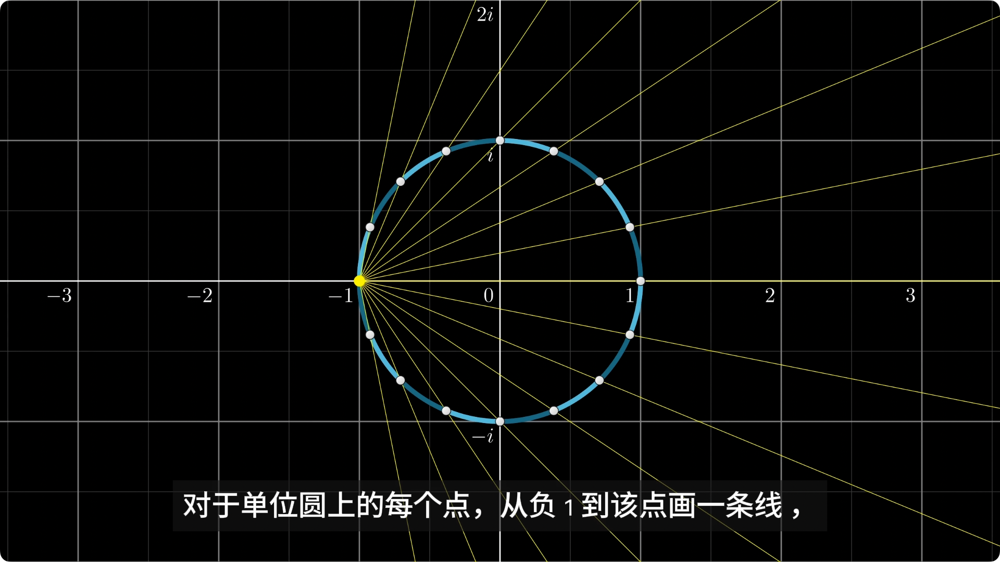

从 $-1$ 点出发，连接圆上每个点并延长与 y 轴相交。

这样 y 轴每个点都是可以看做是圆上每个点的投影，右侧的半圆被投影到圆内部，也就是 $-i$ 到 $i$ 之间，而左侧半圆则被投影到外面。

我们假定，小莱只能看到 $i$ 轴，所以 $i$ 和 $-i$ 就是 二维空间和一维空间重合的点，这是小莱可以直接看到的，然而不在 $i$ 轴的点就只能通过投影来进行推测

首先 1 点被投影到原点， $-1$​​ 点则被投影到无穷远处

$\frac{\sqrt{2}}{2}+\frac{\sqrt{2}}{2}i$ 被投影到 $\frac{\sqrt{2}}{2}i$ 点了吗？很显然没有，而是在一个比 $\frac{\sqrt{2}}{2}i$ 点更靠近原点的位置，就好想被缩小了，的确是这样，而且这种缩放还是有迹可循的

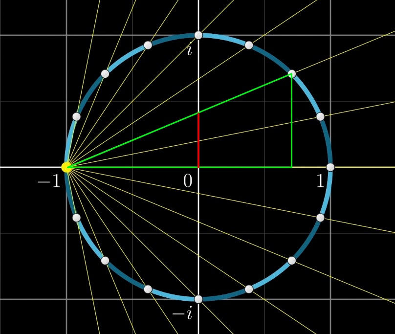

观察上图，相信看到这里你甚至能猜到这为什么叫投影了，$-1$ 就好比是一个观察点，$i$ 轴就是投影面

回到我们讨论的这个点，他被缩小的比例就是 $\frac{1}{1+\frac{\sqrt{2}}{2}}$ 

而且我们还可以计算出，缩放比例就是 $\frac{1}{1+a}$ ，也就是说，$a$ 这个实部决定着缩放比例，也就是如果实部为 0 ，那么缩放比例则为 1 ，因为他完全落在了虚轴上

回忆我们刚才学习过的复数乘法，他是作用于整个二维坐标系所有的点，所有的点，都等比例缩放，旋转相同的角度，就像你的手在这个坐标轴搓碟一样

现在我们取二维坐标系任意一点 $a+bi$ ，计算 $i\cdot (a+bi)=-b+ai$ ，然后计算这两个点连线原点的夹角 $cos\theta=\frac{a\cdot(-b)+a\cdot b}{\sqrt{(a^2+b^2)(a^2+b^2)}}=0$ ，所以 $\theta=90°$ ，左乘 $i$ 就是旋转 90°

这样 $p$ 点的投影也会随着旋转改变，这些投影点，就是我们要展示给小莱的

### 二维生物——菲利克斯

同样的，菲利克斯只能理解二维的图像，我们该如何向他解释球体的旋转呢？

首先我们又定义了一个 $j$ 轴，它垂直于实轴和 $i$ 轴，并且为了方便，我们旋转一下，让 $i$ 和 $j$ 位于水平方向

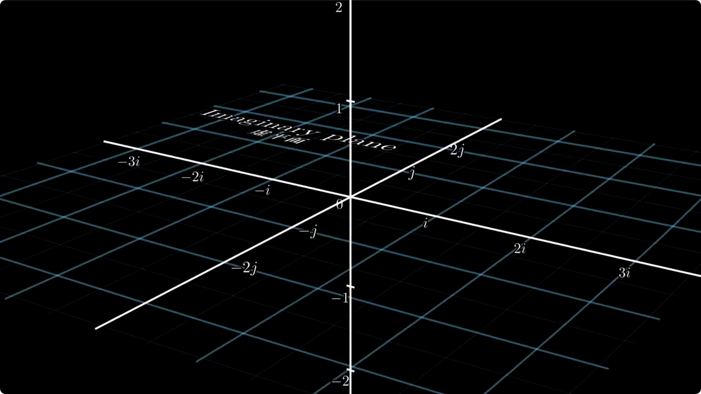

类比将单位圆投影到直线上，我么们从 $-1$ 点出发，将单位球上的点投影到平面上

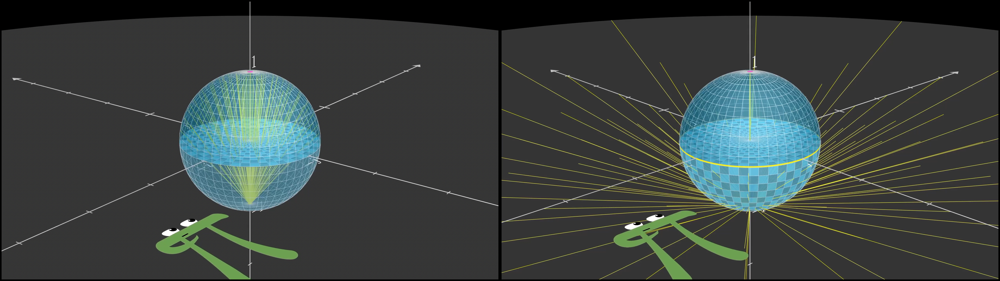

下半部分的球体被投影到了单位圆的外面，上半部分的球体被投影到了单位圆的内部

最终投影是这样的

同样 $1$ 会被投影到原点， $-1$ 点呢，则被投影到了无穷远处

而这次这条赤道一样的圆就是三维空间和二维空间重合的地方

同样，球旋转，投影出来的面也会旋转

> 但不幸的是：无法给三维复数 $w+xi+yj$ 定义一个完美的乘法
>
> 因为它不满足反对称性，因为相乘的时候，无法避免地会出现 $i\cdot j$ 
>
> 在四元数中 $i\cdot j=k$ ，$k$ 是另一个维度，而三维里无法处理这个 $k$ ，这个 $k$ 是一个四维坐标系的维度，所以我们很难去解释 $i\cdot j$ 所以就没有乘法

但我们可以计算比例，缩放比例也是 $\frac{1}{1+w}$ ，$w$ 为实部，意思是如果实部为 0，则投影比例为 1，因为实部为 0 说明了它完全落在虚平面上

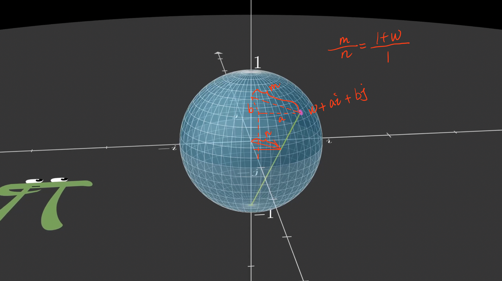

### 三维生物——你

#### 四元数的代数意义

这下我们要开始使用四元数了，回顾一下我们用的前两个数

* 虚数： $3.14+159i$
* 不是真正数系的“三维复数”：$3.14+159i+535j$
* 四元数： $1+2i+3j+4k$ 

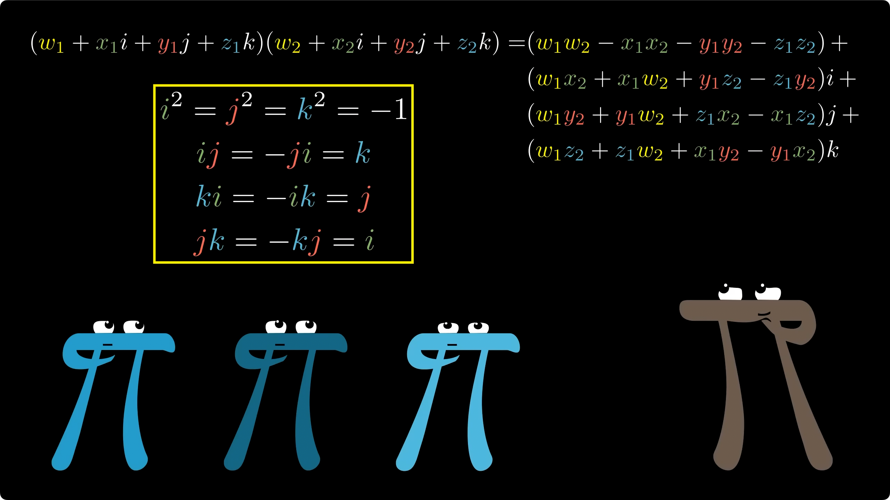

四元数的乘法就像我们这样，代数看着有些复杂，但是很简单，就像这样

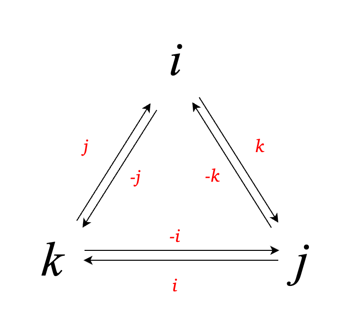

就这这样，应该可以看懂这个图的含义

数学家哈密顿将不含有实部的四元数，定义为向量，

我们可以使用向量的乘法来表达四元数的计算方法，这样更加简洁优雅

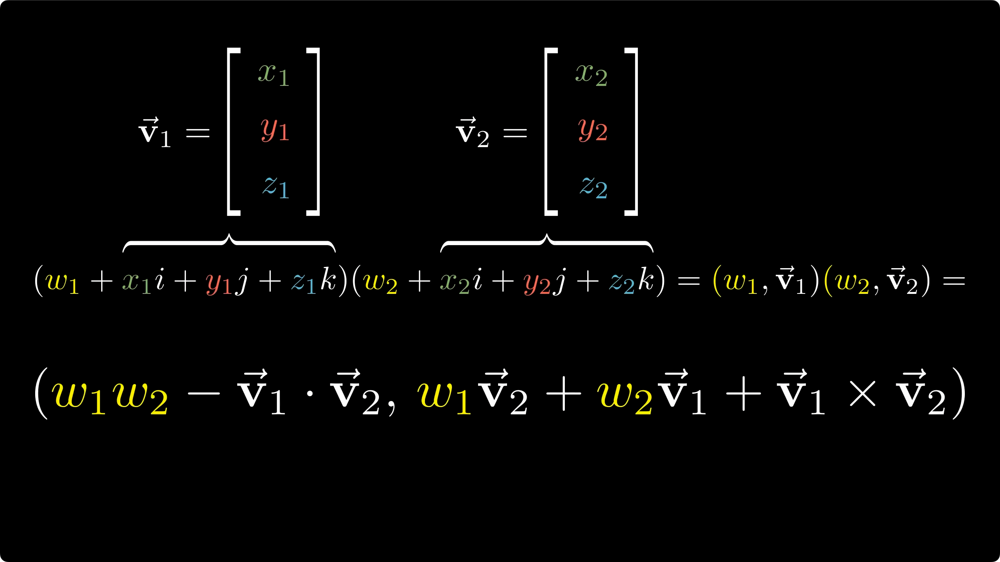

> 向量乘法
>
> 点乘 $(x_1,y_1,z_1)\cdot(x_2,y_2,z_2)=x_1x_2+y_1y_2+z_1z_2$ 
>
> 叉乘 $(x_1,y_1,z_1)\times (x_2,y_2,z_2) = (x_1i+y_1j+z_1k)(x_2i+y_2j+z_2k) = (y_1z_2-z_1y_2k)i+(z_1x_2-x_1z_2)j+(x_1y_2+y_1x_2)k$

#### 四元数的几何意义

##### 投影后的变换

相对于虚数点到原点的距离 $||a+bi||=\sqrt{a^2+b^2}$ ，同样四元数类似 $||w+ai+bj+ck||=\sqrt{w^2+a^2+b^2+c^2}$ 

并且，类比 $z_1\cdot z_2$ 中把 $z_1$ 看做函数， $q_1\cdot q_2$ 中，也把 $q_1$ 看做函数。
$z_1$ 的作用是拉伸旋转 $z_2$ ，同样 $q_1$ 的作用也是拉伸旋转 $q_2$​ ，但是旋转是 4 维的旋转

> ps：视频里有一处错误
>
> 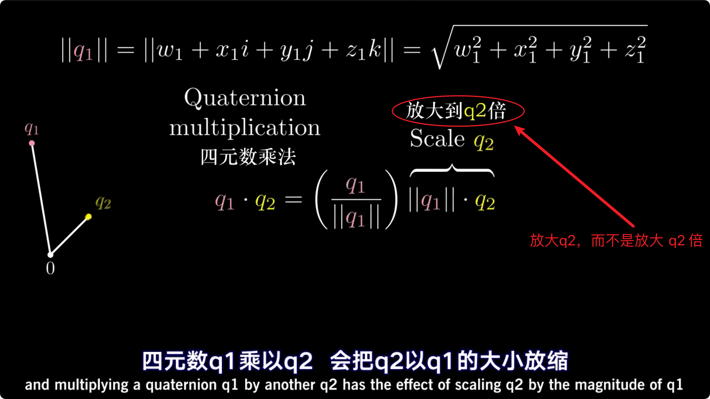

理解什么是 4 维的旋转，就需要我们从低维来观察，也就是通过三维世界的变换，推测四维世界的变换

四维的坐标系是这样的，他有四个轴，这四个轴相互垂直，但这样的坐标系我们画不出来，所以只能将 $i轴$ $j轴$ $k轴$ 画出来，并想象还有一条实轴垂直于这三条轴，为什么这样画，因为 $i轴$ $j轴$ $k轴$ 所构成的坐标系，都是一个四维物体的投影，就像前面三维投影到二维，二维投影到一维一样。

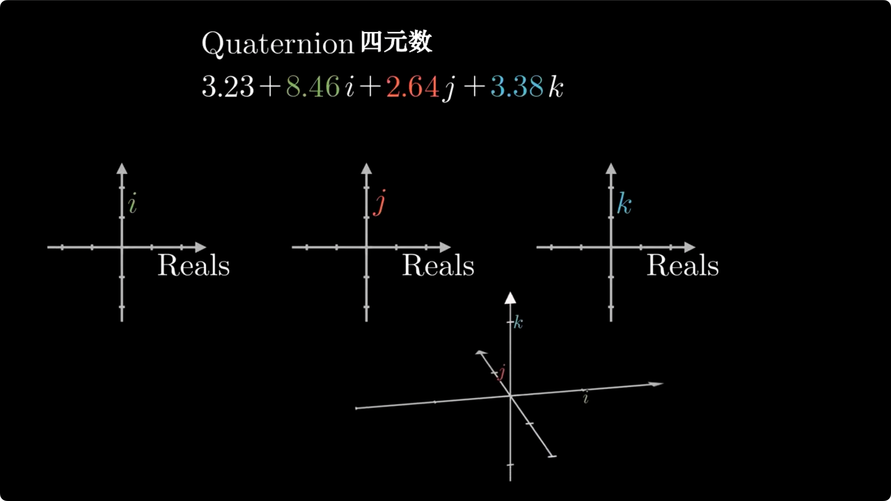

我们将一个单位四维超球投影到三维世界，这个单位四维超球满足的条件就是 $\sqrt{w^2+a^2+b^2+c^2}=1$ ，也就是点距离原点都是 1

类比于二维投影，有一维的两点重合，三维投影有二维的一个圆重合，四维投影有三维的一整个球面重合

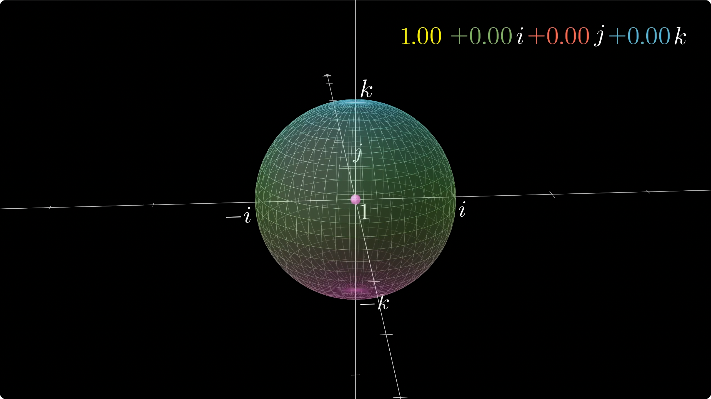

所以，我们在三维空间里看到的单位球，代表着四维超球投影到我们空间中不变的部分

也正如三维投影到二维，那个赤道代表着三维实部为 0 的部分，这个三维球面代表着四维空间中实部为 0 的部分

为什么呢？可能你也发现了，我们一直在做的就是将所有轴的点，都投影到虚轴上

并且，只要看实部的正负就可以看出来他会投影到哪个位置，对于二维投影，实部为正，就投影到 $(-1,1)$ ，为负，就投影到 $(-\infty,-1)\cup(1,+\infty)$ ；对于三维投影，实部为正，就投影到 $i^2+j^2<1$ ，实部为负，就投影到 $i^2+j^2>1$ ；对于四维投影呢？二维投影可以看成，$i^2<0$ 和 $i^2>0$ ，所以四维投影自然就是——实部为正，就投影到 $i^2+j^2+k^2<1$ 也就是三维单位球内部，实部为负，就投影到 $i^2+j^2+k^2>1$ 也就是三维单位球外部

对于 1 点（意思是 $i$、$j$、$k$ 的系数都是 0），会投影到原点的位置，而 $-1$ 会被投影到无限远的地方

> 注意：虽然看着每个点的投影距离原点的距离有所不同，但其实他是在一个单位超四维球体上，所以每个点都距原点相同的距离，就像二维平面上的圆被投影到虚轴上，三维球被投影到虚平面上是一样
>
> 这种现象，其实是投影的拉伸效果导致的

> 这时，你可能会有疑问，三维空间中的原点，和四维空间的是同一个点吗？
>
> 毕竟二维投影里，三维投影里，看起来他们都是同一个原点。
>
> 但答案是否定的，不仅如此，二维投影和三维投影里的原点其实也不是同一个，因为我们已经把所有的高维的点全部投影到低维空间了，并且是全部占满了所有的点，并且之前我们曾提到过 $-1$ 点被投影到了原点。那么这个原点呢？没错他压根不在单位（圆、球、四维超球）上。所以它就没被投影。我们在低维看到的原点其实是高维空间的 $-1$ 点

从一维到二维，我们可以计算出缩放比例和旋转角度，比例为 $\frac{1}{1+w}$ 

从二维到三维，我们同样可以计算缩放比例 $\frac{1}{1+w}$ ，但旋转角度难以计算，因为我们需要引入 $ij$ 的计算结果，这其实是四元数的子集

而从三维到四维，我们可以推出，同样 实部 $w$ 决定了缩放比例，比例为 $\frac{1}{1+w}$​ ，同样如果实部为 0 ，则说明它完全在虚空间中，投影的比例为 1

就像二维单位圆投影到一维虚轴上，我们在这里看到 每个直线 的时候，就明白这其实代表一个圆，一个经过 $-1$ 点的圆

正如三维球体投影到二维平面，每个平面就是一个三维球体投影出来的，并且这个球经过 $-1$ 点

##### 四元数乘法对应的变换

我们先用 $i$ 左乘一个四元数，也就是四维空间的一个点
$$
i\cdot (w+ai+bj+ck) = -a+wi-cj+bk
$$

我们观察这个点的变换，这是一个相互垂直的两个圆的同时旋转，一个是 实轴、i 轴组成的平面上的单位圆，这个圆被投影成了三维平面中的 i 轴，而另一个是 j 轴 k 轴组成平面的单位圆

第一个圆呈现出来的是在 i 轴上移动的点，第二个圆则是能看见的旋转

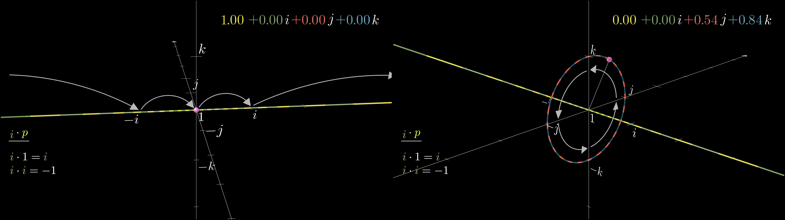

为什么呢？

我们分开来看，首先是前两个数，由 $w+ai$ 变成了 $-a+wi$ ，这和我们在二维投影时候的计算规律一致

再看后两个数，由 $bj+ck$ 变成了 $-cj+bk$ 也是旋转 90 度，只不过前两个数由于实轴被投影到了虚轴上，所以我们看到的是一条线，而 $j、k$ 没有被投影，所以看到的是实实在在的一个圆

> ps：
>
> 视频里说，这两个圆相互垂直，但是同心同半径而且完全不相交，这也是因为一个是投影，另一个是实实在在的圆

你可以通过，右手定则来判断这两个圆的关系

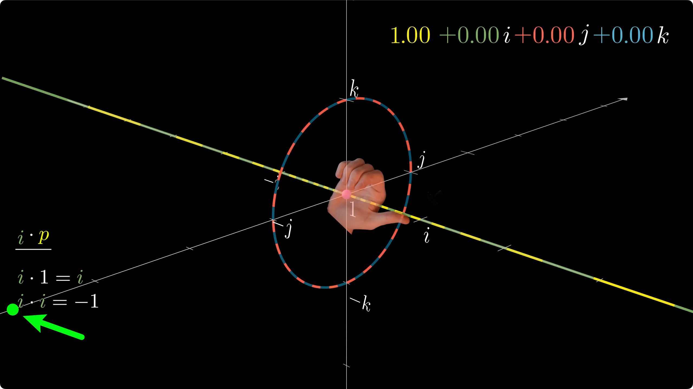

直线延大拇指方向移动，而圆顺四指的方向旋转

* 如果你有一个点，在 $k$ 点，他会出现什么现象? 
  首先，它的实部为 0，系数的平和为 1 ，则投影在三维球体的球面上
  计算 $ik=-j$ ，还在 这个单位圆上，所以 $k$  点左乘 $i$ ，结果就是会旋转 90°
  
* 如果这个点在 $\frac{\sqrt{2}}{2}i+\frac{\sqrt{2}}{2}k$ ，会出现什么现象？
  首先，它的实部为0，系数的平方和等于 1 ，则投影在三维球体的球面上
  计算 $i\cdot (\frac{\sqrt{2}}{2}i+\frac{\sqrt{2}}{2}k)=-\frac{\sqrt{2}}{2}-\frac{\sqrt{2}}{2}j$ ，我们知道，类比二维投影， $-\frac{\sqrt{2}}{2}-\frac{\sqrt{2}}{2}j$ 这个点，就在图中绿色这个位置

  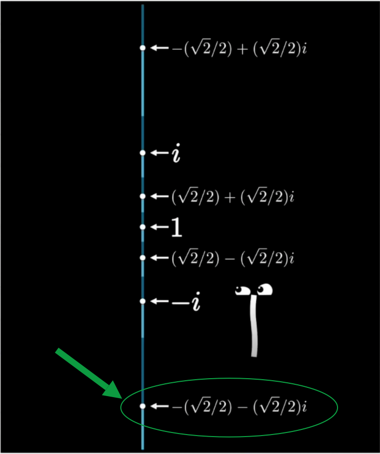
  
  实部和 $i$ 决定了他会在投影上移动 $\frac{1}{1+\frac{\sqrt{3}}{3}}-0=\frac{3-\sqrt{3}}{2}$ （计算缩放比例)

其实研究到这里就差不多了，如果你还想验证其他的点的变化，依照这种方式就可以了

现在可以直接向你展示整个球的变化了

**<u>观看视频 26:02 ~ 28:42</u>**

如果你知道了每个单位（i、j、k）对应的变换，那么你就可以理解任意一个四元数对应的所有变换，因为四元数满足分配律

# 应用四元数

## 感受四元数

还是那个作者 [3Blue1Brown-B站个人空间](https://space.bilibili.com/88461692)  [3Blue1Brown_youtube](https://www.youtube.com/@3blue1brown)

[bilibili链接](https://www.bilibili.com/video/BV1Lt411U7og/) [youtube链接](https://www.youtube.com/watch?v=zjMuIxRvygQ&ab_channel=3Blue1Brown)

这个视频里有一个网站，里面有可以让你自己来手动操作四元数 https://eater.net/quaternions

## 应用到三维旋转

### 公式

四元数中，绕一个轴旋转 $\theta$ 度数， 我们需要用一个单位向量定义这个轴 $l=xi+yj+zk$ ，然后用角度设置它 $cos\frac{\theta}{2}+sin\frac{\theta}{2}(xi+yj+zk)$ ，然后，我们定一个点，$p=ai+bj+ck$ ，使用这个看起来像三明治一样的东西来计算
$$
q\cdot p\cdot q^{-1},（q^{-1} 表示\ q\ 的共轭)\\\\
(w+xi+yj+zk)(ai+bj+ck)(w-xi-yj-zk)\\
$$

> 为什么要用 $\frac{\theta}{2}$ ？为什么要乘两个四元数？
>
> 假设只乘以一个四元数，
>
>  $qp$​ ， $q=cos\beta+sin\beta(xi+yj+zk)$​ 相当于延 $l$​ 进行拉伸，并逆时针旋转 $\beta$​ 度
>
>  $q^{-1}p$ ， $q^{-1}=cos\beta-sin\beta(xi+yj+zk)$ 相当于延 $-l$ 进行拉伸，并顺时针旋转 $\beta$ 度
>
> $pq$​ ， $q=cos\beta+sin\beta(xi+yj+zk)$​ 相当于延 $l$​ 进行拉伸，并顺时针旋转 $\beta$​ 度
>
> $pq^{-1}$ ， $q^{-1}=cos\beta-sin\beta(xi+yj+zk)$ 相当于延 $-l$ 进行拉伸，并逆时针旋转 $\beta$​ 度
>
> 如果你能理解这些
>
> 那么肯定就能理解 $q\cdot p\cdot q^{-1}$ ，$q=cos\frac{\theta}{2}+sin\frac{\theta}{2}(xi+yj+zk)$ ，它相当于不拉伸，并且逆时针旋转 $2\times \frac{\theta}{2}=\theta$ 度数 

