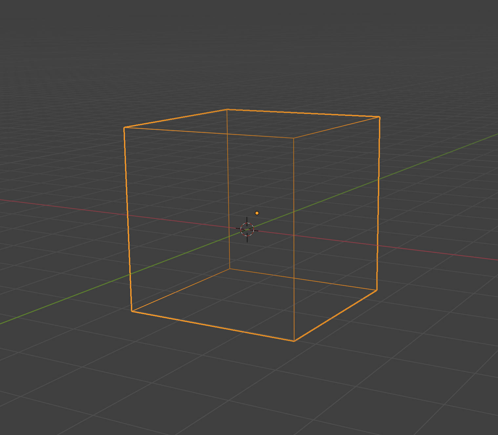
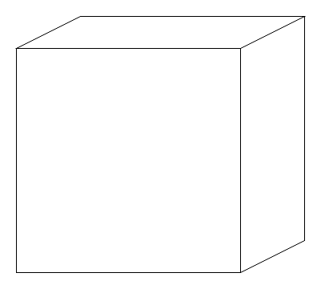
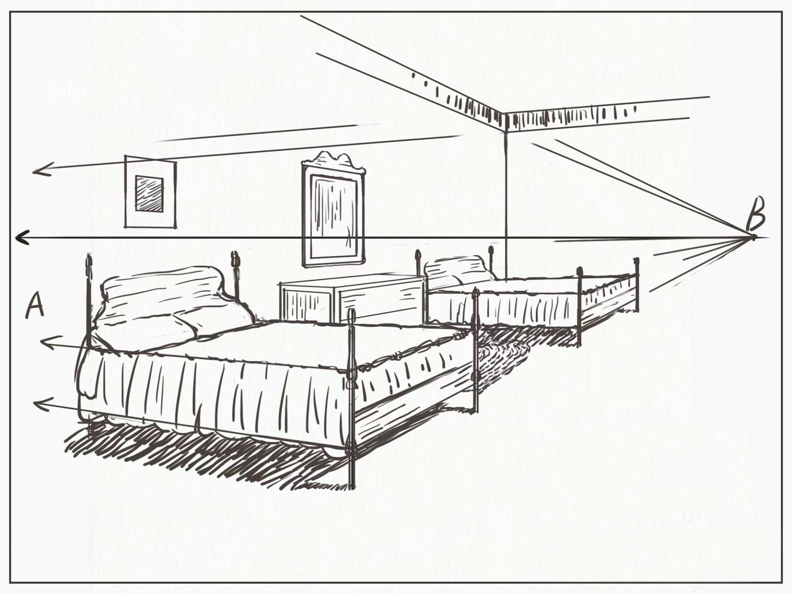
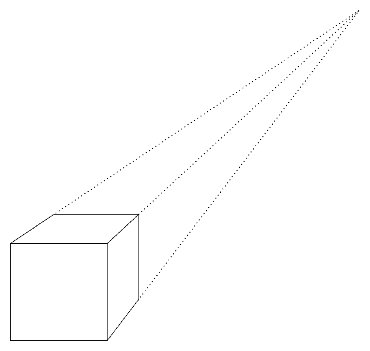

## 世界坐标

### 局部空间（vec local）

对于一个物体，建立它本身的时候，他自己会设置一个坐标系，但这个坐标只在建立它的那个空间可以使用，称为局部坐标，比如你在 Blender 里面构建一个立方体，将这个模型导入其他软件之后，就不会再使用到 Blender 里面的坐标系了，这个在 Blender 里面的坐标就是局部坐标（你可以理解这个局部坐标的是物体的元数据）

也就是你在刚开始学 OpenGL 里，一开始的顶点坐标，都是局部坐标

### 世界空间

我们们需要一个世界坐标，让不同物体显示在不同的位置，这需要 模型矩阵（Model Matrix）来实现，模型矩阵存储着对于当前物体的变换（旋转、缩放）。

大概就是这样 $M_{model}\cdot V_{local}$

### 观察空间

又叫摄像机空间，或者视觉空间。

到现在，我们已经将物体放到了世界坐标系的不同位置，并且进行了变换，但是如果将这些物体呈现在屏幕上，我们需要选一个角度给我们搭的景拍一张照片，这就需要观察空间，又叫摄像机空间。

就像这样 $M_{view}\cdot M_{model}\cdot V_{local}$

### 裁剪空间

裁剪空间会稍微抽象一点，用投影矩阵来实现，它的作用是将呈现在我们屏幕上的坐标进行裁剪。

例如：每个维度上 $(-1000,1000)$ 。投影矩阵会将这个指定范围坐标变换为标准化坐标的范围 $(-1,1)$ 。$(1250,700,500)$ 就会被裁剪掉，因为 $x$ 坐标已经超过了范围。

那么具体该如何裁剪呢？

#### 正射投影

这个其实很常见，我们中学学的数学几何，基本用的都是这种方式

这种方式，每条边与之对边都是平行且相等的

#### 透视投影

透视投影是绘画中用的很多的技巧，比如：

