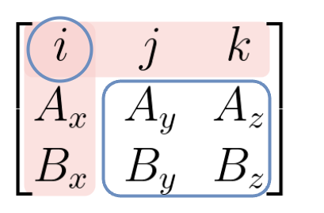
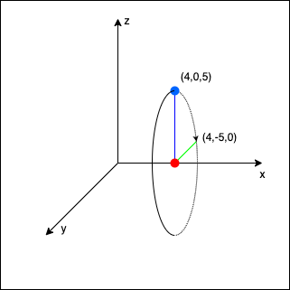
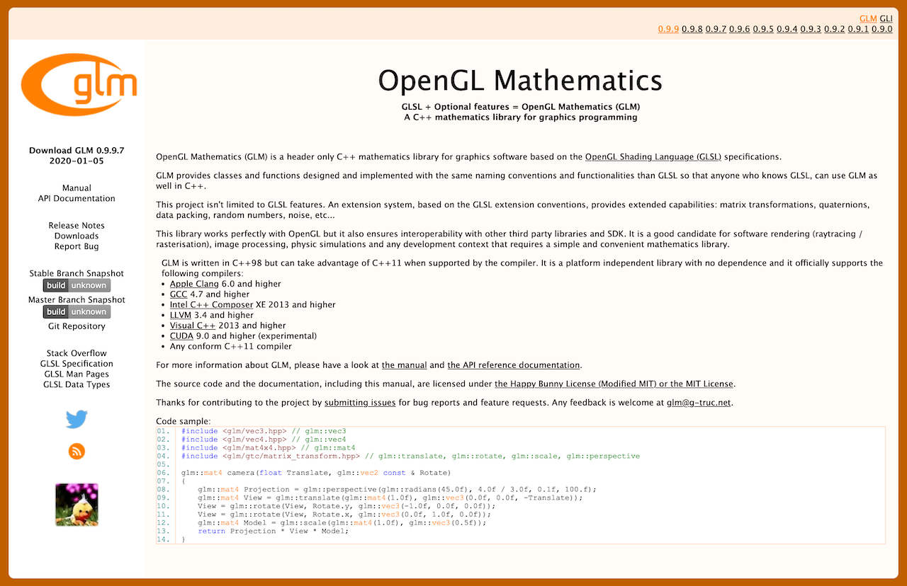
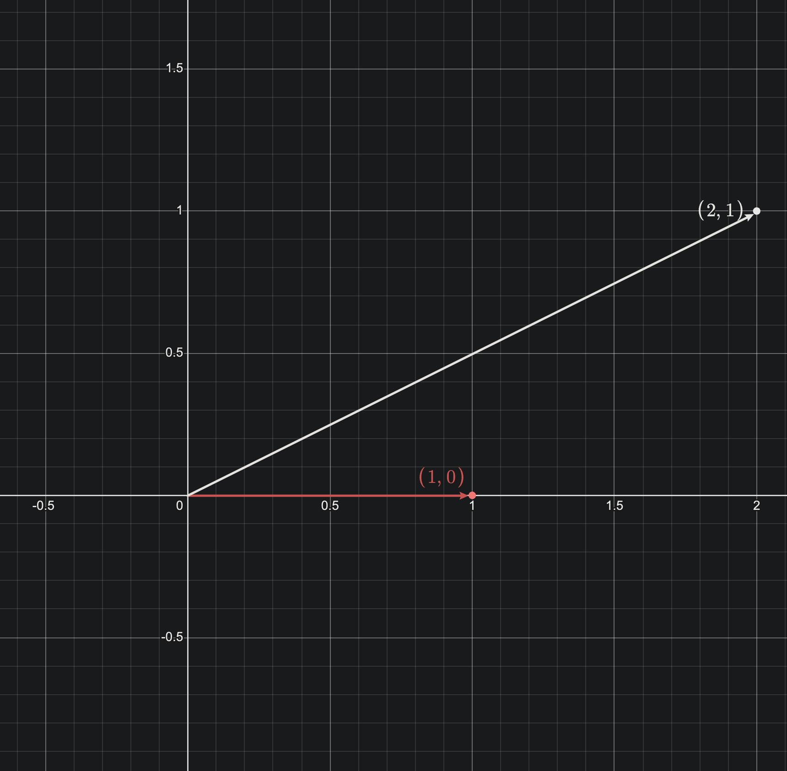
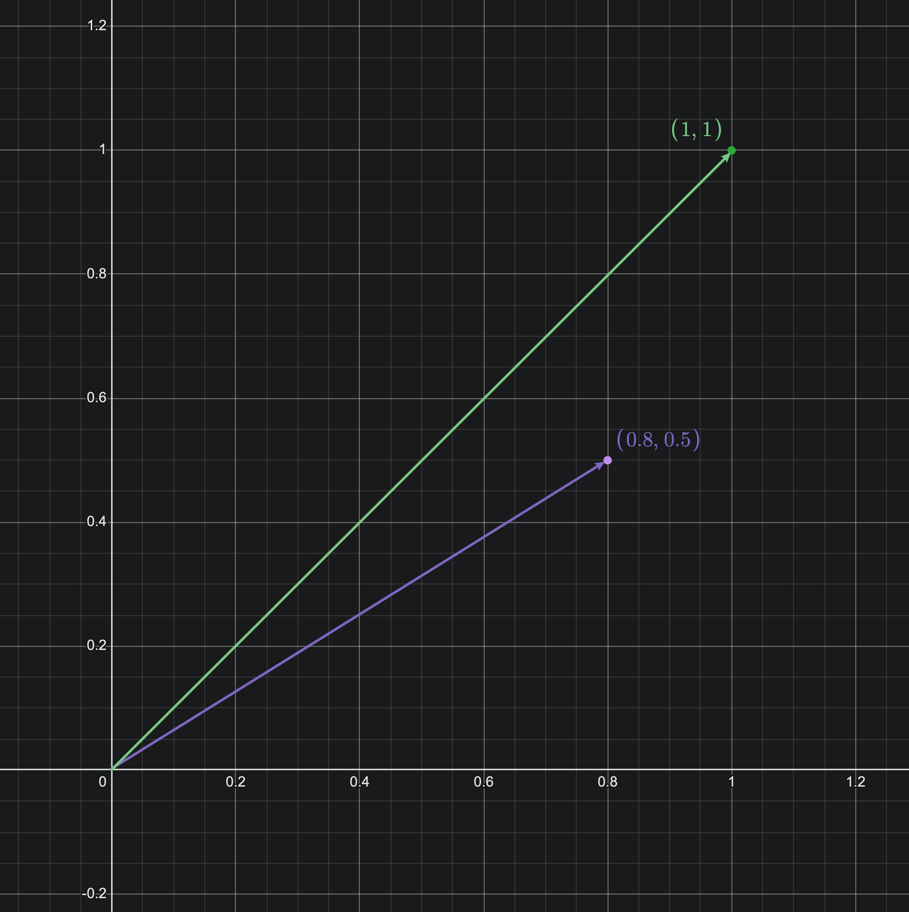
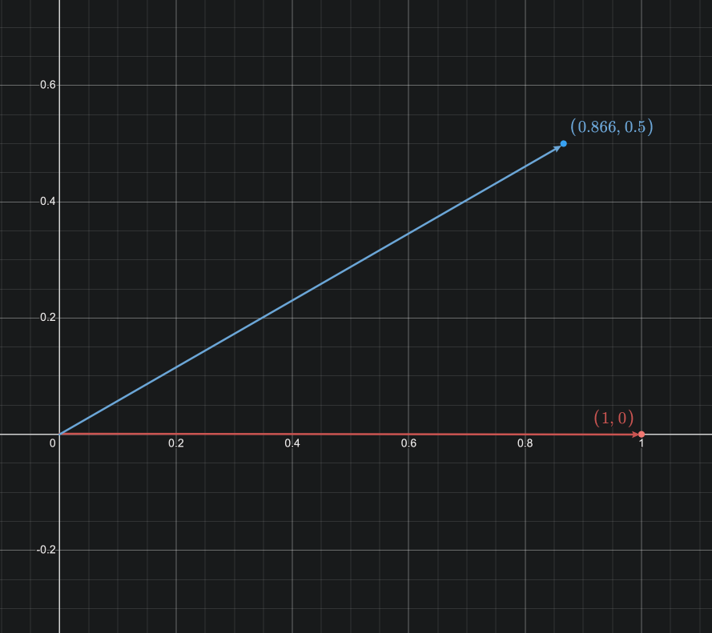

---

---

## 向量

### 向量点乘（内积）

$$
A = \begin{bmatrix}
a_{11} & a_{12} & ... & a_{1n}\\
a_{21} & a_{22} & ... & a_{2n}\\
a_{31} & a_{22} & ... & a_{3n}\\
\vdots & \vdots & \ddots & \vdots\\
a_{n1} & a_{n2} & ... & a_{nn}
\end{bmatrix} ,
b = \begin{bmatrix}
b_{1}\\
b_{2}\\
b_{3}\\
\vdots\\
b_{n}
\end{bmatrix}
$$

此方法可类比物理做功


力 $F$ 和位移 $S$ 已给出，需要用 $W = F \cdot S$ 来表示做的功

计算方法就是

$$
W = |F||S|cosθ
$$

所以向量点乘（内积）就是向量模相乘再乘夹角余弦，也就是他的几何形式：

$$
\vec a\cdot\vec b = |\vec a||\vec b|cosθ
$$

代数形式是：
$$
\vec a \cdot \vec b = \sum_{i=1}^{n}a_1b_1+a_2b_2+\cdot \cdot \cdot +a_nb_n
$$
或者这个

$$
\vec a \vec b = \vec a \cdot {\vec b}^{T}
$$

例如：
$$
\begin{bmatrix}
1&3&-5\end{bmatrix}
\begin{bmatrix}
4\\
-2\\
-1
\end{bmatrix}
=
\begin{bmatrix}
3
\end{bmatrix}
=3
$$


两个向量相乘变成了一个单数字矩阵


### 向量叉乘（外积）

此方法可以

计算方法

$$
\vec a\times\vec b = |\vec a||\vec b|\sin{θ}\ \vec n
$$

$ \vec n$ 指向右手坐标系大拇指位置，$\vec a$ 为食指，$\vec b$​ 为中指

为什么用右手，因为我们用的就是右手坐标系，又称笛卡尔坐标系


> 注意：这个坐标轴可以随意旋转，只要不做镜像反转就行

坐标形式
$$
\vec A = (A_x,A_y,A_z)
$$

$$
\vec B = (B_x,B_y,B_z)
$$

$$
\begin{bmatrix}
i & j & k \\
A_x & A_y & A_z\\ 
B_x & B_y & B_z
\end{bmatrix}
= \begin{bmatrix}
A_y & A_z\\ 
B_y & B_z
\end{bmatrix}i 
+ 
\begin{bmatrix}
A_x & A_z\\ 
B_x & B_z
\end{bmatrix}j
+
\begin{bmatrix}
A_x & A_y\\ 
B_x & B_y
\end{bmatrix}k
$$

$$
\vec A \times \vec B = (A_y B_z-A_z B_y)i+(A_x B_z-A_z B_x)j+(A_x B_y-A_y B_x)k
$$

系数是这么算的（子行列式）



> 如果你对这种计算方式感到疑惑，不用意外，我也曾感到意外，因为叉乘仿佛是一个代数和集合杂糅在一起的计算，但他们融合的有非常生硬，很反直觉……吗？其实不是，我们接着看
>
> 为什么叉乘的等号前面是括号坐标形式的向量，而等号右边是 $i、j、k$ ？你注意到这个了吗？
>
> 我们把等号前面也改成  $i、j、k$ 的形式
> $$
> \begin{align}
> & (A_xi+A_yj+A_zk)(B_xi+B_yj+B_zk) \\
> = & A_xB_xi^2+A_yB_yj^2+A_zB_zk^2+A_xB_yij+A_zB_xik+A_yB_zjk+A_yB_xji+B_yA_zjk+B_zA_xki+B_zA_ykj
> \end{align}
> $$
> 没错，我们用的完全就是代数乘法
>
> 为什么我将 $ij、ji、jk、kj、ik、ki$ 分开，因为 $i、j、k$​ 是每个轴的单位向量，他们相乘需要用到叉乘
>
> 通过叉乘计算你就能得到
> $$
> \left\{\begin{matrix}
> \begin{align*}\label{2}
> & ij=-ji=k \\
> & ki=-ik=j \\
> & jk=-kj=i
> \end{align*}
> \end{matrix}\right.
> $$
> 没错同方向或者相反方向的向量相乘，就会失去方向
>
> 我们继续合并完这个式子，得到如下
> $$
> A_xB_xi^2-A_yB_yj^2-A_zB_zk^2+(A_y B_z-A_z B_y)i+(A_x B_z-A_z B_x)j+(A_x B_y-A_y B_x)k
> $$
>
> 这里，相同方向的向量 $sin\theta=0$ ，所以这里的 $-A_xB_x-A_yB_y-A_zB_z=0$​​ 
>
> 你可以学习一下四元数的计算，这能更好地帮助你理解向量叉乘 => [四元数的代数意义](OpenGL-四元数.md\#四元数的代数意义)

## 矩阵

### 矩阵乘法

- 数乘

$$
3
\times
\left[
\begin{matrix}
a & b & c \\
d & e & f \\
g & h & i
\end{matrix}
\right]
=
\left[
\begin{matrix}
3a & 3b & 3c \\
3d & 3e & 3f \\
3g & 3h & 3i
\end{matrix}
\right]
$$

- 相乘

$$
\left[
\begin{matrix}
1 & 2 & 3 \\
4 & 5 & 6 \\
7 & 8 & 9
\end{matrix}
\right]
\cdot
\left[
\begin{matrix}
a & b & c \\
d & e & f \\
g & h & i
\end{matrix}
\right]
=
\left[
\begin{matrix}
a+2d+3g & b+2e+3h & c+2f+3i \\
4a+5d+6g & 4b+5e+6h & 4c+5f+6i \\
7a+8d+9g & 7b+8e+9h & 7c+8f+9i
\end{matrix}
\right]
$$

$$
\left[
\begin{matrix}
1 & 2 & 3 \\
\end{matrix}
\right]
\cdot
\left[
\begin{matrix}
a & b \\
d & e \\
g & h
\end{matrix}
\right]
=
\left[
\begin{matrix}
a+2d+3g & b+2e+3h
\end{matrix}
\right]
$$

$$
A_{m \times n}\cdot B_{n \times h} = C_{m \times h}
$$

前面的行乘以后面的列

也就是，第一个矩阵的行数决定了最终矩阵的行数，第二个矩阵的列数决定了最终矩阵的列数 

并且，第一个矩阵一行有几个元素，第二个矩阵一列就得有几个元素，这样才能进行运算

### 矩阵变换

矩阵变换一般指 要变换的向量或矩阵，左乘变换矩阵，生产成最终变换好的矩阵的过程

#### 左乘和右乘

假设有个矩阵 A ，左乘 A 就是将 A 放到乘号左边，右乘就是将 A 放到乘号右边

$$
\begin{bmatrix}
\color{red}{S_1} & \color{red}0 & \color{red}0 & \color{red}0 \\
\color{green}0 & \color{green}{S_2} & \color{green}0 & \color{green}0 \\
\color{yellow}0 & \color{yellow}0 & \color{yellow}{S_3} & \color{yellow}0 \\
\color{pink}0 & \color{pink}0 & \color{pink}0 & \color{pink}1
\end{bmatrix}
\cdot
\begin{bmatrix}
x \\
y \\
z \\
w
\end{bmatrix}
=
\begin{bmatrix}
\color{red}{S_1} \cdot x\\
\color{green}{S_2} \cdot y \\
\color{yellow}{S_3} \cdot z \\
\color{pink}1 \cdot w
\end{bmatrix}
$$

这就是 $ 向量 \begin{bmatrix} x \\ y \\ z \\ w \end{bmatrix} 左乘矩阵 \begin{bmatrix} \color{red}{S_1} & \color{red}0 & \color{red}0 & \color{red}0 \\ \color{green}0 & \color{green}{S_2} & \color{green}0 & \color{green}0 \\ \color{yellow}0 & \color{yellow}0 & \color{yellow}{S_3} & \color{yellow}0 \\ \color{pink}0 & \color{pink}0 & \color{pink}0 & \color{pink}1 \end{bmatrix} $

或者说 $ 矩阵 \begin{bmatrix} \color{red}{S_1} & \color{red}0 & \color{red}0 & \color{red}0 \\ \color{green}0 & \color{green}{S_2} & \color{green}0 & \color{green}0 \\ \color{yellow}0 & \color{yellow}0 & \color{yellow}{S_3} & \color{yellow}0 \\ \color{pink}0 & \color{pink}0 & \color{pink}0 & \color{pink}1 \end{bmatrix} 右乘向量 \begin{bmatrix} x \\ y \\ z \\ w \end{bmatrix}$

#### 缩放

[learnopengl-cn](https://learnopengl-cn.github.io/) 中使用的矩阵都是 $4\times 4$ 的矩阵，也就是以下
$$
\begin{bmatrix}
\color{red}{S_1} & \color{red}0 & \color{red}0 & \color{red}0 \\
\color{green}0 & \color{green}{S_2} & \color{green}0 & \color{green}0 \\
\color{yellow}0 & \color{yellow}0 & \color{yellow}{S_3} & \color{yellow}0 \\
\color{pink}0 & \color{pink}0 & \color{pink}0 & \color{pink}1
\end{bmatrix}
\cdot
\begin{bmatrix}
x \\
y \\
z \\
w
\end{bmatrix}
=
\begin{bmatrix}
\color{red}{S_1} \cdot x\\
\color{green}{S_2} \cdot y \\
\color{yellow}{S_3} \cdot z \\
\color{pink}1 \cdot w
\end{bmatrix}
$$

这样除了对角线（左上到右下的对角线）其余都是零的矩阵，就叫缩放矩阵（对角线也可以有 0）

$\begin{bmatrix} \color{red}S_1 \\ \color{green}S_2 \\ \color{yellow}S_3 \end{bmatrix}$​​ 就是缩放向量

上面我们定义了一个 4 维向量在 3d 空间里的缩放，将 $x$ 方向放大（缩小）为原来的$S_1$ 倍，将 $y$ 方向放大（缩小）为原来的 $S_2$ 倍，将 $z$ 方向放大（缩小）为原来的 $S_3$ 倍

这个用 4 维向量表示 3 维向量的方式，涉及到一个概念叫 齐次坐标！！！建议不了解的可以学一下，后面我们或许还会提到

但其实如果你使用 $3\times 3$​ 的矩阵，道理也是一样的
$$
\begin{bmatrix}
\color{red}{S_1} & \color{red}0 & \color{red}0 \\
\color{green}0 & \color{green}{S_2} & \color{green}0 \\
\color{yellow}0 & \color{yellow}0 & \color{yellow}{S_3} \\
\end{bmatrix}
\cdot
\begin{bmatrix}
x \\
y \\
z
\end{bmatrix}
=
\begin{bmatrix}
\color{red}{S_1} \cdot x\\
\color{green}{S_2} \cdot y \\
\color{yellow}{S_3} \cdot z \\
\end{bmatrix}
$$
后面我依旧使用 4 维矩阵和 4 维向量


#### 位移

$$
\begin{bmatrix}  
\color{red}1 & \color{red}0 & \color{red}0 & \color{red}{T_x} \\
\color{green}0 & \color{green}1 & \color{green}0 & \color{green}{T_y} \\
\color{yellow}0 & \color{yellow}0 & \color{yellow}1 & \color{yellow}{T_z} \\
\color{pink}0 & \color{pink}0 & \color{pink}0 & \color{pink}1
\end{bmatrix}
\cdot
\begin{bmatrix}
x \\
y \\
z \\
1
\end{bmatrix}
=
\begin{bmatrix}
x + \color{red}{T_x} \\
y + \color{green}{T_y} \\
z + \color{yellow}{T_z} \\
\color{pink}1
\end{bmatrix}
$$

$\begin{bmatrix}  \color{red}{T_x} \\ \color{green}{T_y} \\ \color{yellow}{T_z} \end{bmatrix}$ 就是位移向量

位移（Translation）是在原始向量的基础上加上另一个向量从而获得一个在不同位置的新向量的过程，从而在位移向量基础上移动了原始向量。

##### 齐次坐标(Homogeneous Coordinates)

一个向量 `vec4(x,y,z,w)` ，向量的w分量也叫齐次坐标。

w 分量通常是 1.0。

使用齐次坐标有几点好处：它允许我们在3D向量上进行位移（如果没有w分量我们是不能位移向量的）。

如果一个向量的齐次坐标是 0，这个坐标就是方向向量(Direction Vector)，因为w坐标是0，这个向量就不能位移。

#### 旋转

首先，绕哪个轴旋转，哪个轴不动

- 绕 x 轴旋转 θ

$$
\begin{bmatrix}
\color{red}1 & \color{red}0 & \color{red}0 & \color{red}0 \\
\color{green}0 & \color{green}{\cos \theta} & \color{green}{-\sin \theta} & \color{green}0 \\
\color{yellow}0 & \color{yellow}{\sin \theta} & \color{yellow}{\cos \theta} & \color{yellow}0 \\
\color{pink}0 & \color{pink}0 & \color{pink}0 & \color{pink}1
\end{bmatrix}
\cdot
\begin{bmatrix}
x \\
y \\
z \\
1
\end{bmatrix}
=
\begin{bmatrix}
x \\
\color{green}{\cos \theta} \cdot y - \color{green}{\sin \theta} \cdot z \\
\color{yellow}{\sin \theta} \cdot y + \color{yellow}{\cos \theta} \cdot z \\
1
\end{bmatrix}
$$

- 绕 y 轴旋转 θ

$$
\begin{bmatrix}
\color{red}{\cos \theta} & \color{red}0 & \color{red}{\sin \theta} & \color{red}0 \\
\color{green}0 & \color{green}1 & \color{green}0 & \color{green}0 \\
- \color{yellow}{\sin \theta} & \color{yellow}0 & \color{yellow}{\cos \theta} & \color{yellow}0 \\
\color{pink}0 & \color{pink}0 & \color{pink}0 & \color{pink}1
\end{bmatrix}
\cdot
\begin{bmatrix} x \\
y \\
z \\
1
\end{bmatrix}
=
\begin{bmatrix} \color{red}{\cos \theta}
\cdot
x + \color{red}{\sin \theta} \cdot z \\
y \\
- \color{yellow}{\sin \theta} \cdot x + \color{yellow}{\cos \theta} \cdot z \\
1
\end{bmatrix}
$$

- 绕 z 轴旋转 θ

$$
\begin{bmatrix}
\color{red}{\cos \theta} & - \color{red}{\sin \theta} & \color{red}0 & \color{red}0 \\
\color{green}{\sin \theta} & \color{green}{\cos \theta} & \color{green}0 & \color{green}0 \\
\color{yellow}0 & \color{yellow}0 & \color{yellow}1 & \color{yellow}0 \\
\color{pink}0 & \color{pink}0 & \color{pink}0 & \color{pink}1
\end{bmatrix}
\cdot
\begin{bmatrix}
x \\
y \\
z \\
1
\end{bmatrix}
=
\begin{bmatrix} \color{red}{\cos \theta} \cdot x - \color{red}{\sin \theta} \cdot y \\
\color{green}{\sin \theta} \cdot x + \color{green}{\cos \theta} \cdot y \\
z \\
1
\end{bmatrix}
$$

绕 x 轴旋转 90° 的例子



$$
\begin{bmatrix} \color{red}1 & \color{red}0 & \color{red}0 & \color{red}0 \\
\color{green}0 & \color{green}{0} & \color{green}{-1} & \color{green}0 \\
\color{yellow}0 & \color{yellow}{-1} & \color{yellow}{0} & \color{yellow}0 \\
\color{pink}0 & \color{pink}0 & \color{pink}0 & \color{pink}1 \end{bmatrix}
\cdot
\begin{bmatrix}
a \\
b \\
c\\
1
\end{bmatrix}
=
\begin{bmatrix}
a \\
\color{green}{-c} \\
\color{yellow}{-b} \\
1
\end{bmatrix}
$$

##### 万向节死锁

利用旋转矩阵我们可以把任意位置向量沿一个单位旋转轴进行旋转。

也可以将多个矩阵复合，比如先沿着x轴旋转再沿着y轴旋转。但是这会很快导致一个问题——万向节死锁（Gimbal Lock）。

> 万向节死锁的原因是坐标轴会跟着图形一起旋转，而并非一直呈现为标准的坐标轴样子
>
> 推荐在 B站 或者 YouTube 搜索一些关于万向节死锁的视频，会帮助你理解这个问题产生的原因

在这里我们不会讨论它的细节，但是对于3D空间中的旋转，一个更好的模型是沿着任意的一个轴，比如单位向量 $(0.662, 0.2, 0.7222)$ 旋转，而不是对一系列旋转矩阵进行复合。

这样的一个（超级麻烦的）矩阵是存在的，见下面这个公式，其中 $(\color{red}{Rx},\color{green}{Ry},\color{yellow}{Rz} \color{white})$ 代表任意旋转轴：

$$
\begin{bmatrix}
\cos \theta + \color{red}{R_x}^2(1 - \cos \theta) &
\color{red}{R_x}\color{green}{R_y}(1 - \cos \theta) - \color{yellow}{R_z} \sin \theta &
\color{red}{R_x}\color{yellow}{R_z}(1 - \cos \theta) + \color{green}{R_y} \sin\theta &
0 \\
\color{green}{R_y}\color{red}{R_x} (1 - \cos \theta) + \color{yellow}{R_z} \sin \theta &
\cos \theta + \color{green}{R_y}^2(1 - \cos \theta) &
\color{green}{R_y}\color{yellow}{R_z}(1 - \cos \theta) - \color{red}{R_x} \sin \theta &
0 \\
\color{yellow}{R_z}\color{red}{R_x}(1 - \cos \theta) - \color{green}{R_y} \sin \theta &
\color{yellow}{R_z}\color{green}{R_y}(1 - \cos \theta) + \color{red}{R_x} \sin \theta &
\cos \theta + \color{yellow}{R_z}^2(1 - \cos \theta) &
0 \\
0 & 0 & 0 & 1
\end{bmatrix}
$$

> 以下是 [learnopengl-cn](https://learnopengl-cn.github.io/) 对于万向节死锁的解释
>
> 在数学上讨论如何生成这样的矩阵仍然超出了本节内容。
>
> 但是记住，即使这样一个矩阵也不能完全解决万向节死锁问题（尽管会极大地避免）。
>
> 避免万向节死锁的真正解决方案是使用四元数(Quaternion)，它不仅更安全，而且计算会更有效率。四元数可能会在后面的教程中讨论。
>
> 对四元数的理解会用到非常多的数学知识。如果你想了解四元数与3D旋转之间的关系，可以来阅读我的[教程](https://krasjet.github.io/quaternion/)。如果你对万向节死锁的概念仍不是那么清楚，可以来阅读我教程的[Bonus章节](https://krasjet.github.io/quaternion/bonus_gimbal_lock.pdf)。
>
> 现在3Blue1Brown也已经开始了一个四元数的视频系列，他采用球极平面投影(Stereographic Projection)的方式将四元数投影到3D空间，同样有助于理解四元数的概念（仍在更新中）：https://www.youtube.com/watch?v=d4EgbgTm0Bg

#### 矩阵组合变换

假设一个向量，我们希望将其缩放2倍，然后位移 $(1, 2, 3)$ 个单位

$$
Trans \cdot Scale =
\begin{bmatrix}
\color{red}1 & \color{red}0 & \color{red}0 & \color{red}1 \\
\color{green}0 & \color{green}1 & \color{green}0 & \color{green}2 \\
\color{blue}0 & \color{blue}0 & \color{blue}1 & \color{blue}3 \\
\color{purple}0 & \color{purple}0 & \color{purple}0 & \color{purple}1
\end{bmatrix}
\cdot
\begin{bmatrix} \color{red}2 & \color{red}0 & \color{red}0 & \color{red}0 \\
 \color{green}0 & \color{green}2 & \color{green}0 & \color{green}0 \\
\color{blue}0 & \color{blue}0 & \color{blue}2 & \color{blue}0 \\
\color{purple}0 & \color{purple}0 & \color{purple}0 & \color{purple}1
\end{bmatrix}
 =
\begin{bmatrix}
\color{red}2 & \color{red}0 & \color{red}0 & \color{red}1 \\
\color{green}0 & \color{green}2 & \color{green}0 & \color{green}2 \\
\color{blue}0 & \color{blue}0 & \color{blue}2 & \color{blue}3 \\
\color{purple}0 & \color{purple}0 & \color{purple}0 & \color{purple}1
\end{bmatrix}
$$

当矩阵相乘时我们先写位移再写缩放变换的。

矩阵乘法是不遵守交换律的，这意味着它们的顺序很重要。

当矩阵相乘时，在最右边的矩阵是第一个与向量相乘的，所以你应该从右向左读这个乘法。

建议您在组合矩阵时，先进行缩放操作，然后是旋转，最后才是位移，否则它们会互相影响。

比如，如果你先位移再缩放，位移的向量也会同样被缩放（译注：比如向某方向移动2米，2米也许会被缩放成1米）！

现在我们验证一下，这个矩阵的效果

$$
\begin{bmatrix} \color{red}2 & \color{red}0 & \color{red}0 & \color{red}1 \\
\color{green}0 & \color{green}2 & \color{green}0 & \color{green}2 \\
\color{blue}0 & \color{blue}0 & \color{blue}2 & \color{blue}3 \\
\color{purple}0 & \color{purple}0 & \color{purple}0 & \color{purple}1
\end{bmatrix}
\cdot
\begin{bmatrix} x \\
y \\
z \\
1 \end{bmatrix}
=
\begin{bmatrix}
\color{red}2x + \color{red}1 \\
\color{green}2y + \color{green}2  \\
\color{blue}2z + \color{blue}3 \\
1
\end{bmatrix}
$$

可以看到，他确实放大了两倍，并且平移了 $(1,2,3)$

## 实践

### glm 库

我们需要一个库 [glm](https://glm.g-truc.net/0.9.9/index.html)

相信你非常容易地就猜出来了，这是 gl-math 的缩写

我们就是通过这个库来实现各种矩阵运算



[glm 下载地址](https://github.com/g-truc/glm/releases)

> glm-0.9.9+ 

GLM库从0.9.9版本起，默认会将矩阵类型初始化为一个零矩阵（所有元素均为0），而不是单位矩阵（对角元素为1，其它元素为0）。

如果你使用的是0.9.9或0.9.9以上的版本，你需要将所有的矩阵初始化改为 glm::mat4 mat = glm::mat4(1.0f)。

如果你使用 `kotlin` 编写 OpenGL 代码，也可以用 [glm for kotlin]([https://https://github.com/kotlin-graphics/glm)

我们需要的GLM的大多数功能都可以从下面这3个头文件中找到：

```c++
#include <glm/glm.hpp>
#include <glm/gtc/matrix_transform.hpp>
#include <glm/gtc/type_ptr.hpp>
```

#### 位移实践

我们以 向量(1,0,0) 位移（1,1,0）为例，并且简单说明一下，glm 的使用

```c++
glm::vec4 vec(1.0f, 0.0f, 0.0f, 1.0f);
std::cout << "位移前向量 (" << vec.x << "," << vec.y << "," << vec.z << ")" << std::endl;
// 先初始化，0.9.9及以上版本需要初始化为单位矩阵
glm::mat4 transMat4 = glm::mat4(1.0f);
// 设置延 x 轴，y 轴进行位移
glm::vec3 transVec3 = glm::vec3(1.0f, 1.0f, 0.0f);
// 生成位移矩阵
transMat4 = glm::translate(transMat4, transVec3);
std::cout << "位移矩阵：\n";
printMatrix(transMat4);
// 矩阵和向量相乘
vec = transMat4 * vec;
std::cout << "位移后向量 (" << vec.x << "," << vec.y << "," << vec.z << ")" << std::endl;
```

```c++
void printMatrix(const glm::mat4 &matrix) {
  const float* pMatrix = glm::value_ptr(matrix);
  for (int i = 0; i < 4; ++i) {
    for (int j = 0; j < 4; ++j) {
      std::cout << pMatrix[i + j * 4] << ' ';
    }
    std::cout << std::endl;
  }
}
```

```shell
位移前向量 (1,0,0)
位移矩阵：
1 0 0 1 
0 1 0 1 
0 0 1 0 
0 0 0 1 
位移后向量 (2,1,0)
```



`transMat4` 是单位矩阵

`glm::translate(transMat4, transVec3)` 用来生成位移矩阵

然后向量左乘位移矩阵，实现向量的位移

#### 缩放实践

```c++
glm::vec4 vec(1.0f, 1.0f, 0.0f, 1.0f);
std::cout << "缩放前向量 (" << vec.x << "," << vec.y << "," << vec.z << ")" << std::endl;
// 初始化单位矩阵
glm::mat4 transMat4 = glm::mat4(1.0f);
// x 轴缩放到 0.5，y 轴缩放到 0.8
glm::vec3 scaleVec3 = glm::vec3(0.5f, 0.8f, 0.0);
// 生成缩放矩阵
transMat4 = glm::scale(transMat4, scaleVec3);
std::cout << "缩放矩阵：\n";
printMatrix(transMat4);
// 计算
vec = transMat4 * vec;
std::cout << "缩放后向量 (" << vec.x << "," << vec.y << "," << vec.z << ")\n";
```

```shell
缩放前向量 (1,1,1)
缩放矩阵：
0.5 0 0 0 
0 0.8 0 0 
0 0 2 0 
0 0 0 1 
缩放后向量 (0.5,0.8,2)
```



`transMat4` 是单位矩阵

`glm::translate(transMat4, transVec3)` 用来生成缩放矩阵

然后向量左乘缩放矩阵，实现向量的缩放

#### 旋转实践

```c++
glm::vec4 vec(1.0f, 0.0f, 0.0f, 1.0f);
std::cout << "旋转前向量 (" << vec.x << "," << vec.y << "," << vec.z << ")" << std::endl;
// 初始化单位矩阵
glm::mat4 transMat4 = glm::mat4(1.0f);
// 旋转向量（选择 z 轴）
glm::vec3 transVec3 = glm::vec3(0.0f, 0.0f, 1.0f);
// 生成旋转矩阵
transMat4 = glm::rotate(transMat4, 0.523598333333333f, transVec3);
std::cout << "旋转矩阵：\n";
printMatrix(transMat4);
// 计算
vec = transMat4 * vec;
std::cout << "旋转后向量 (" << vec.x << "," << vec.y << "," << vec.z << ")" << std::endl;
```

```shell
旋转前向量 (1,0,0)
旋转矩阵：
0.866026 -0.5 0 0 
0.5 0.866026 0 0 
0 0 1 0 
0 0 0 1 
旋转后向量 (0.866026,0.5,0)
```



`transMat4` 是单位矩阵

`glm::rotate(transMat4, transVec3)` 用来生成缩放矩阵

然后向量左乘位移矩阵，实现向量的旋转

### opengl

