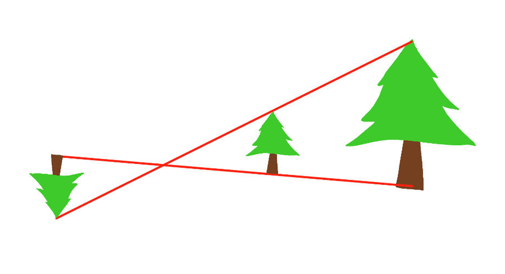
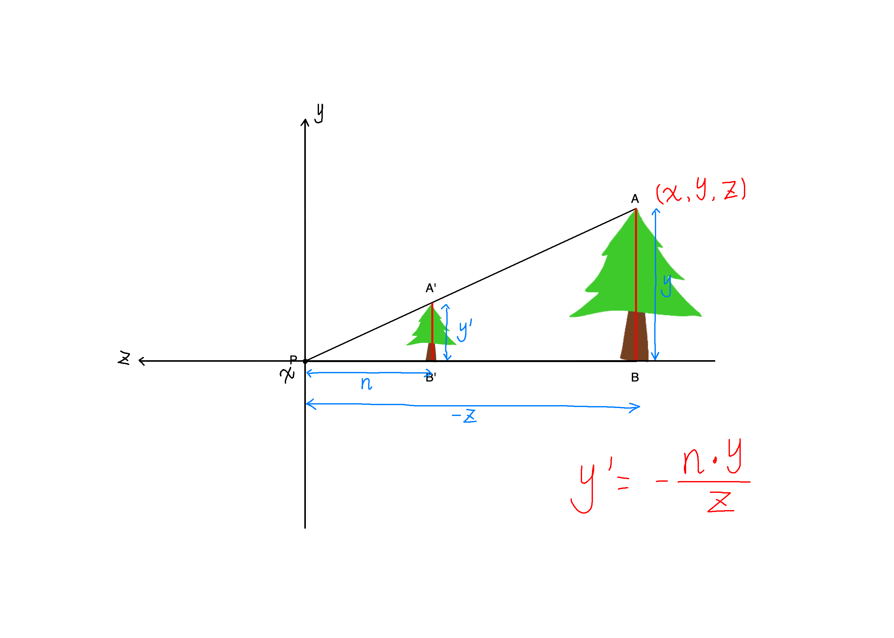
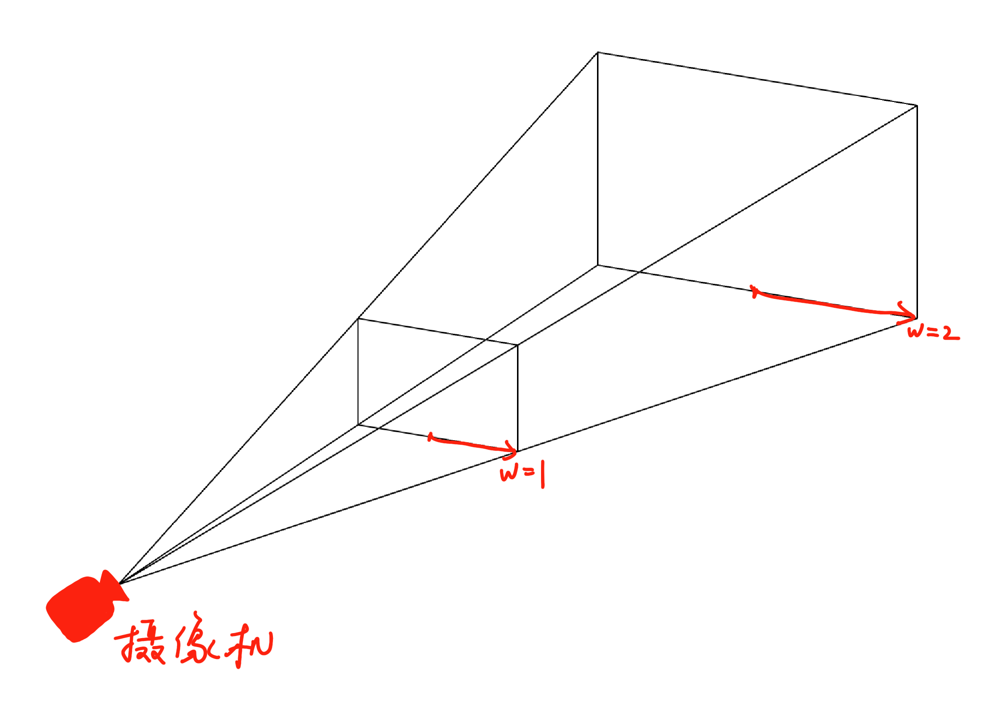

## 非透视投影变换

非透视投影包括 R(旋转)、S(缩放)、T(位移)、虚拟摄像机变换、正视投影变换，所有的非透视投影变换 都是 R S T 组合而来的

### 位移变换

假设我们有一个向量代表一个物体 $V=(x,y)$ ，然后我们想平移它

比如这样：$V^{'}=(x+t_x,y+t_x)$ 

而矩阵运算 $\begin{bmatrix}
a & b \\
c & d
\end{bmatrix}
\cdot 
\begin{bmatrix}
x \\
y
\end{bmatrix}
=
\begin{bmatrix}
ax+by \\
cx+dy
\end{bmatrix}$ 没有办法出现常数，所以我们就可以增加一个维度：$\begin{bmatrix}
x\\
y\\
1
\end{bmatrix}$​ 。然后再使用一个 3×3 的矩阵来做变换
$$
\begin{bmatrix}
x^{'}\\
y^{'}\\
1
\end{bmatrix}
=
\begin{bmatrix}
1 & 0 & t_x \\
0 & 1 & t_y \\
0 & 0 & 1
\end{bmatrix}
\begin{bmatrix}
x\\
y\\
1
\end{bmatrix}
=
\begin{bmatrix}
x+t_x\\
y+t_x\\
1
\end{bmatrix}
$$
得到 $x^{'}=x+x_t$ ， $y^{'}=y+y_t$ 

这样我们就可以完成位移了，这个吧多出来的维度就叫齐次坐标。

> 同样我们统一使用齐次坐标来进行缩放和旋转，因为这样就可以一直保持向量是多一个维度的（也就是多出来的那个齐次坐标），直接相乘不用来回增减齐次坐标了。

$$
T=
\begin{bmatrix}
1 & 0 & t_x \\
0 & 1 & t_y \\
0 & 0 & 1
\end{bmatrix}
$$

### 缩放变换

$$
S=\begin{bmatrix}
s_x & 0 & 0 \\
0 & s_y & 0 \\
0 & 0 & 1
\end{bmatrix}
$$

### 旋转变换

$$
R=
\begin{bmatrix}
cos\theta & -sin\theta & 0 \\
sin\theta & cos\theta & 0 \\
0 & 0 & 1
\end{bmatrix}
$$

### 三维物体变换

#### 位移

$$
T=
\begin{bmatrix}
1 & 0 & 0 & t_x\\
0 & 1 & 0 & t_y\\
0 & 0 & 1 & t_z\\
0 & 0 & 0 & 1
\end{bmatrix}
$$

#### 缩放

$$
S=
\begin{bmatrix}
s_x & 0 & 0 & 0\\
0 & s_y & 0 & 0\\
0 & 0 & s_z & 0\\
0 & 0 & 0 & 1
\end{bmatrix}
$$

#### 旋转

$$
R_x=
\begin{bmatrix}
cos\theta & -sin\theta & 0 & 0\\
sin\theta & cos\theta & 0 & 0\\
0 & 0 & 1 & 0\\
0 & 0 & 0 & 1
\end{bmatrix}
$$

$$
R_y=
\begin{bmatrix}
cos\theta & 0 & -sin\theta & 0 \\
0 & 1 & 0 & 0 \\
sin\theta & 0 & cos\theta & 0 \\
0 & 0 & 0 & 1
\end{bmatrix}
$$

$$
R_z=
\begin{bmatrix}
1 & 0 & 0 & 0 \\
0 & cos\theta & -sin\theta & 0 \\
0 & sin\theta & cos\theta & 0 \\
0 & 0 & 0 & 1
\end{bmatrix}
$$

## 透视投影变换

### 小孔成像

透视投影变换能够呈现出近大远小透视效果，更符合我们的视觉感受

透视投影模拟的是针孔摄像机，或者说小孔成像

小孔成像会在黑盒里的真空后面后面呈现一个倒立的图像，但是我们在计算机里可以将图像放在小孔前面，这样不仅可以避免图像颠倒，写代码的时候还会更直观

而且这个小孔的位置就可以成为我们的观察点

### 矩阵计算

然后我们就可以计算一下这个最终呈现的像的大小

如图所示，我们用相似可以简单推出 $y^{'}=-\frac{n\cdot y}{z}$ （ $py=-z$ 是因为坐标 $z$ 是 $A$ 点的 $z$​ 轴坐标）

成像的 $y^{'}$ 与 $z$ 成反比，正好符合近大远小的规律

然而，矩阵运算是乘法和加法，没法很方便地计算除法

所以我们这里使用齐次坐标
$$
\begin{bmatrix}
A & B & C \\ 
E & F & G \\ 
I & J & K 
\end{bmatrix}
\cdot
\begin{bmatrix}
x\\
y\\
z
\end{bmatrix}
=
\begin{bmatrix}
Ax+By+Cz\\
Ex+Fy+Gz\\
Ix+Jy+Kz
\end{bmatrix}
$$
最终将得到的向量除以 $z$ 分量得到：$\begin{bmatrix}
\frac{Ax+By+Cz}{Ix+Jy+Kz}\\
\frac{Ex+Fy+Gz}{Ix+Jy+Kz}\\
1
\end{bmatrix}$ 就得到了最终的答案，在成像位置不变的时候，$z$ 越小显示的图像越大，反之越小，三维物体也是同样的道理：
$$
\begin{bmatrix}
A & B & C & D\\ 
E & F & G & H\\ 
I & J & K & L\\ 
M & N & O & P
\end{bmatrix}
\cdot
\begin{bmatrix}
x\\
y\\
z\\
w
\end{bmatrix}
=
\begin{bmatrix}
Ax+By+Cz+Dw\\
Ex+Fy+Gz+Hw\\
Ix+Jy+Kz+Lw\\
Mx+Ny+Oz+Pw
\end{bmatrix}
$$
归一化：
$$
\begin{bmatrix}
\frac{Ax+By+Cz+Dw}{Mx+Ny+Oz+Pw}\\
\frac{Ex+Fy+Gz+Hw}{Mx+Ny+Oz+Pw}\\
\frac{Ix+Jy+Kz+Lw}{Mx+Ny+Oz+Pw}\\
1
\end{bmatrix}
$$

1. 可以看到， $D$ $H$ $L$ 会与 $w$ 相乘，从而实现位移
2.  $M$ $N$ $O$ 会与  $x$ $y$ $z$ 相乘，并加和在 $w$ 分量上
3. $\begin{bmatrix}
   A & B & C \\ 
   E & F & G \\ 
   I & J & K 
   \end{bmatrix}$ 左上角这个矩阵完成旋转
4. 主对角线完成缩放

### 齐次坐标的原理

$w$ 分量所表达的就是比例变换，可以看到图中的 $w=1$ 的时候平移和 $w=2$ 的位移距离完全不一样

> 将矩阵运算出来的向量分量除以 $w$ ，并将 $w$ 置为1（也可以减去 $w$ 这个维度），这个过程叫做归一化

> 坐标 $(x,y,z)的齐次坐标为(wx,wy,wz,w)$​ 
>
> 我们以三维物体投影到二维平面为例：
>
> 一个 $(2,4,3)$ 坐标，映射到 $z=5$ 的平面上
>
> 他的计算过程应该是这样的
>
> 先做归一化 $(\frac{2}{3},\frac{4}{3},1)$ ，然后再翻到 $z=5$ 的平面 $(\frac{2}{3}\times 5,\frac{4}{3}\times 5,5)=(\frac{10}{3},\frac{20}{3},5)$ ，最终得到了坐标

