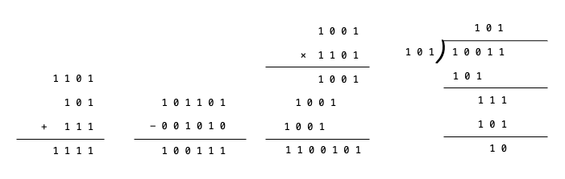
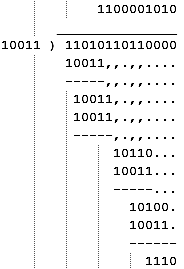
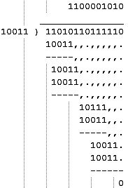
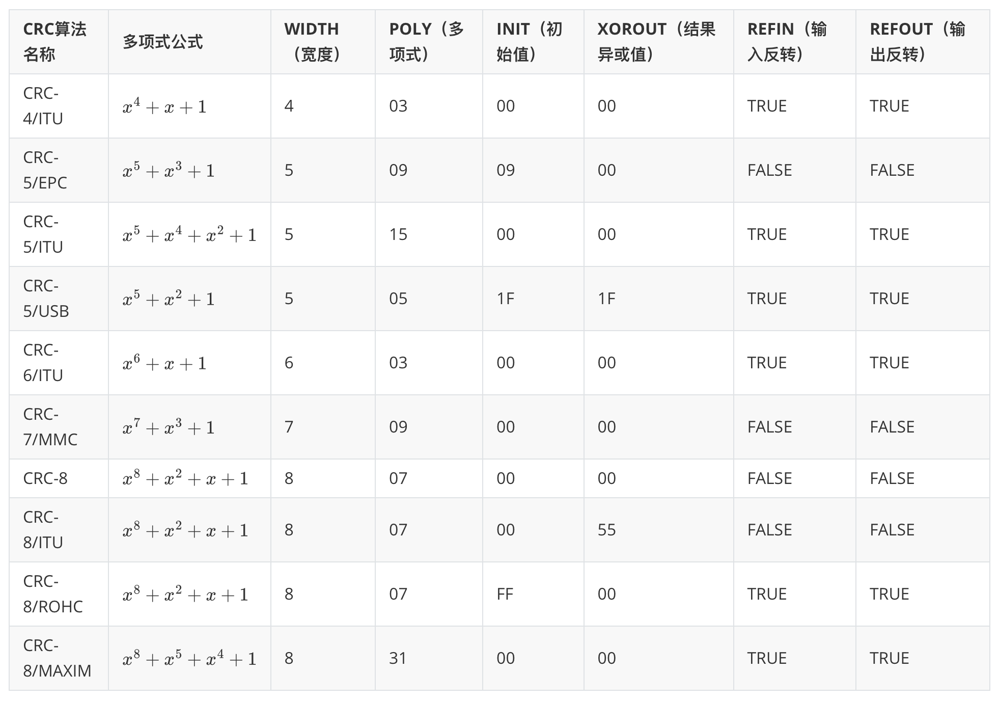
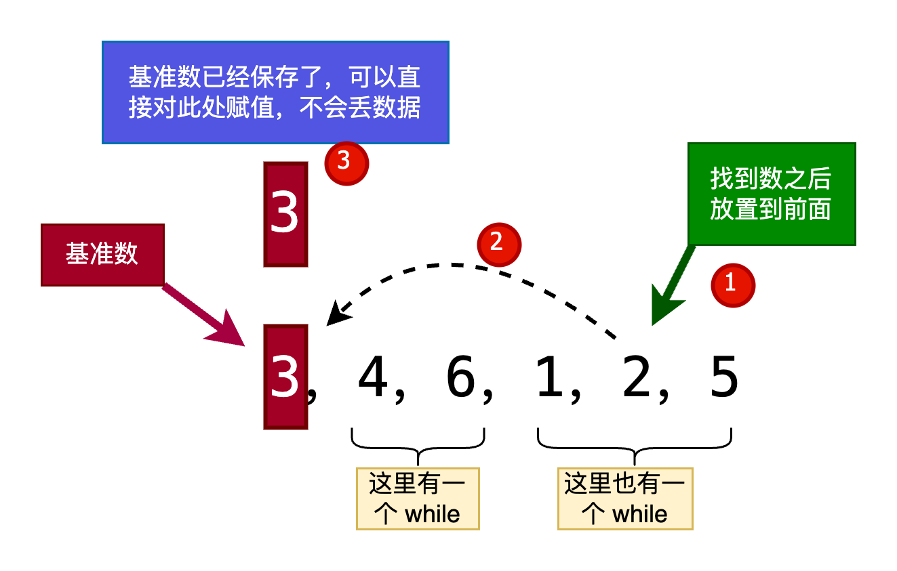
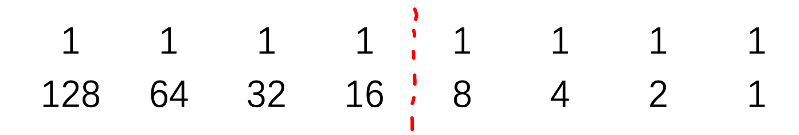
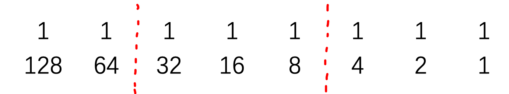
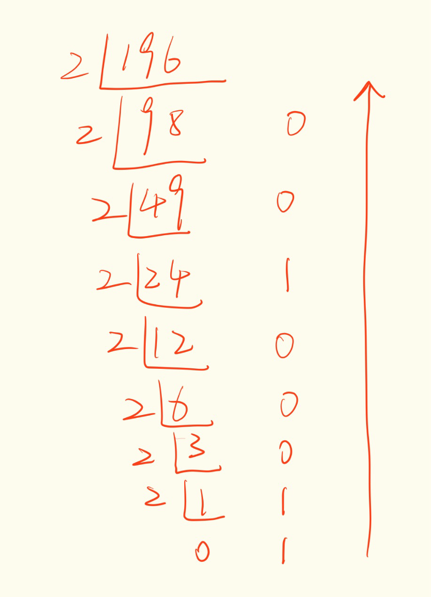
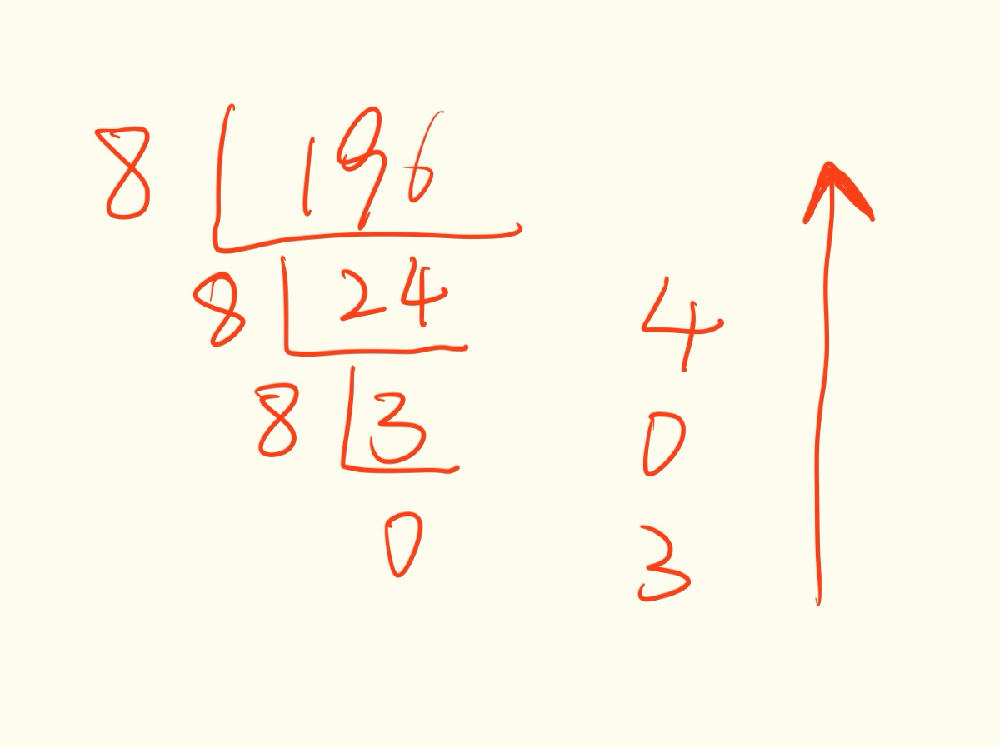
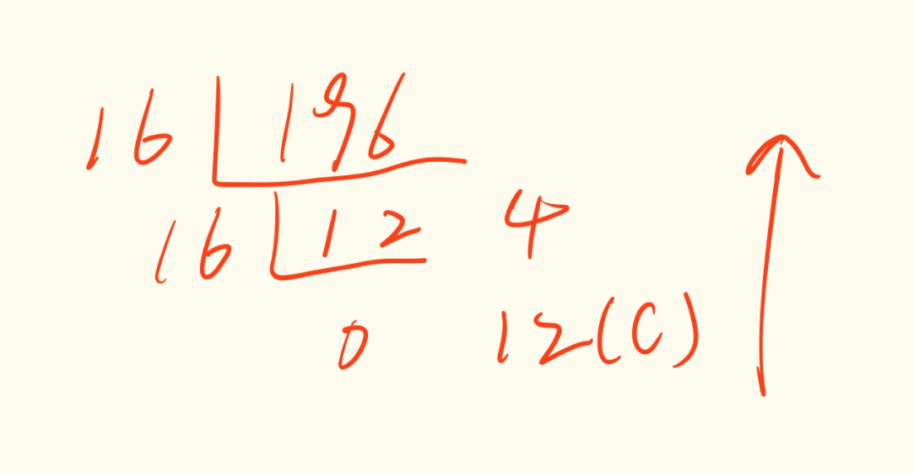

---

# 1 CRC 循环冗余校验（Cyclic Redundancy Check， CRC）

## 1.1 原理解释

CRC 的原理是模二除法。

模二运算是一种二进制算法。与四则运算相同，模二运算也包括加、减、乘、除四种运算，运算符也是相同的。



模二除法

* 当最后余数的位数小于除数位数时，除法停止。
* 当被除数的位数小于除数位数时，则商数为0，被除数就是余数。
* 只要被除数或部分余数的位数与除数一样多，且最高位为1，不管其他位是什么数，皆可商1。

## 1.2 实际应用

实际应用时，发送方和接收方按以下方式通信：

1. 发送方和接收方在通信前，约定好一个预设整数作为除数。
2. 发送方在发送前根据原始数据和约定好的除数进行模二除法运算生成余数（即CRC码），然后将其附加到原始数据后面一起发送给接收方。
3. 接收方收到后将其模二除以约定好的除数，当且仅当余数为 0 时接收方认为没有差错。

**示例**:

假设要传输的原始数据为 `1101011011B`，发送方和接收方在通信前约定好的除数为 `10011B`。由于除数10011B是五位数（5bit），那么假设余数（即CRC码）为四位数（4bit）。因为现在余数未知，所以在进行模二除法运算前先将余数设为 `0000B`，即待发送的数据为`11010110110000B`。

下面开始进行模二除法运算来确定余数（即CRC码）：



可见余数（即CRC码）为 `1110B`，因此发送方实际发送的是 `11010110111110B`。

接收方在接收后需要将其模二除以10011B来进行CRC校验：



可见余数为0，因此本次通信没有差错。

## 1.3 数学描述

### 1.3.1 基本原理

设原始数据为 $D(x)$ ，约定好的除数为 $P(x)$，$P(x)$ 最高次数为 $r$ ，模二除法运算的余数为 $R(x)$ ，即 $R(x) = [2^r D(x)]mod P(x)$，CRC码为 $F(x)$，实际发送的数据为 $T(x)$。

显然，$T(x)=2^{r}D(x)+F(x)$。

所以CRC算法问题变为：求解 $F(x)$ 使 $T(x)modP(x)=0$。（这里不考虑正负，所以取模和取余等效）

$$
    \begin{align*}
    &T(x)modP(x) \\
    &=[2^{r}D(x)+F(x)]modP(x) \\
    &=[2^{r}D(x)]modP(x)+F(x)modP(x) \\
    &=R(x)+F(x) \\
    \end{align*}
$$

注意，这里是模二加法，模二加法里，两个相同的数，相加会等于 0

取 $F(x) = R(x)$

$$
    \begin{align*}
    & R(x)+F(x) \\
    &=R(x)+R(x) \\
    &=0 \\
    &modP(x)=0 \\
    \end{align*}
$$

故 $F(x)=R(x)=[2^{r}D(x)]modP(x)$。

### 1.3.2  如何确定 $P(x)$

所以，CRC 主要涉及 3 个数

* 原始数据 $D(x)$
* 约定除数 $P(x)$
* 余数 $R(x)$

原始数据是已经确定好的要发送的数据，余数是通过 $2^rD(x)\div p(x)$ 来计算出的

那么 $P(x)$ 该如何确定呢

实际上，$P(x)$ 是由一种称为 `本原元` 的特殊多项式计算而来的，P(x)应该满足：

* 最高位和最低位都是 1
* 当被传送信息任何一位发生错误时，$P(x)$ 不被 $T(x)$ 整除（ $T(x)$ 是实际发送的数据 ）
* 不同位发生错误时，余数应该不同
* 对余数继续做模二除法时，应该使余数循环

## 1.4 常见 CRC 类型（部分）



上表中，

* 多项式公式代表着除数，也就是 $P(X)$，你会发现他的除数 符合最高位最低位都是 1
* 宽度就是 CRC 码的二进制位数
* 初始值是运算初始值。需要将被除数先减去初始值再进行计算
* 结果异或值和输入输出反转都是对结果进行的操作

上面局的计算例子就是 CRC-4/ITU，具体流程如下：

1. 我们确定被除数是否需要反转（反转就是0变1，1变0），这里不需要反转
2. 先减去初始值，这里是0
3. 然后通过多项式公式确定除数为10011
4. 计算完之后在看是否需要异或运算，这里不需要
5. 最后再看是否需要反转，这里也不需要

# 2 数据库

## 2.1 关系代数

[数据库-关系代数](数据库-关系代数.md)

## 2.2 SQL 语句

### 2.2.1 概述

语句分4类

* DQL 数据查询（select）
* DDL 数据定义（create table，alter table，drop table）
* DML 数据操作（insert，update，delete）
* DCL 数据控制（grant，revoke）

基本操作？我也不知道这些属于什么类型的语句

``` sql
# 创建数据库
create database 数据库名

# 显示所有的数据库
show databases;

# 切换到指定数据库
use 数据库名;

# 显示表结构
desc 表名;

# 显示 sql 语句（以 table 为例）
show create table <table>;
```

### 2.2.2 DDL

```sql
# 创建表
create table 表名(
  列名 类型 [列-完整性约束],
  列名 类型 [列-完整性约束],
  列名 类型 [列-完整性约束],
  ...
) 表-完整性约束;
```

```sql
# 修改表
alter table 表名 [操作语句];
```

操作语句有

* `add 列名 类型 [列-完整性约束]` 增加新列和新的完整性约束
* `drop column 列名` 删除列和指定的完整性约束条件
* `alter column 列名 类型` 修改列名和数据类型
* `add primary key(列名，...)` 增加主键
* `add foreign key(列名) referneces (列名)` 增加外键
* `add default key [默认值] for (列名)`
* `add check (约束表达式)`
* `add unique (列名)`

```sql
# 删除表
drop table 表名 [restrict|cascade]; # 默认是 restrict ，cascade 是删除相关的其他依赖，包括索引、视图、触发器等等

# 删除并重建表（格式化）
truncate table 表名;
```

### 2.2.3 DML

```sql
insert [into] 表名 [(属性列,...)]
values (常量,...);
```

# 3 算法

## 3.1 快速排序

直接上代码

```kotlin
fun quickSort(a: IntArray, l: Int, r: Int) {

    if (l < r) {
        var i = l
        var j = r
        val x = a[i]
        while (i < j) {
            while (i < j && a[j] > x) {
                j--
            }
            if (i < j) {
                a[i++] = a[j]
            }
            while (i < j && a[i] < x) {
                i++
            }
            if (i < j) {
                a[j--] = a[i]
            }
        }
        a[i] = x
        quickSort(a, l, i - 1)
        quickSort(a, i + 1, r)
    }
}
```

我不知道为什么，快排我每次都要重新学，每次学完，过了半年，再问我，我就只记得“选一个基准数，把比他小的放在左边，比他大的放在右边”，然后后面的就不记得了

感觉是因为我，对于数据的精细操作，不够熟练，比如链表，数组，while 循环之类的

首先，假设我们有一个数组 `a[6] = 3，4，6，1，2，5`

1. 我们首先要选一个基准数，比如 `a[0] = 3` 对应第 6 行代码
2. 然后我们要先从右找比基准数小的数，这里使用 `while 循环` `j--` ，循环的条件是当没有找到比基准数小，并且 `i<j`

   同样，我们在左边找到比基准数更小的，循环条件也要对应改变

   对应第 8 到 第 19 行代码

   这里有一个知识点，在将右边那个较小得数赋值到左边 i 位置的时候，可以直接赋值而不是交换，因为 i 位置已经被赋值给了 基准数 pri ，所以不会丢数据

   并且在后续，将左边那个较大的数赋值到右边 j 的时候，可以直接赋值，因为 j 位置的数据已经在刚才赋值给左边了

   我称之为 `连环存储 不丢数据 赋值`

   

3. 请注意，这是我觉的一个难点，就是 while 循环的条件

   这里一级循环条件是 `i<j` ，因为在找到一大一小并进行赋值之后，进行判断，是否需要再进行下一次循环

   而内部的二级循环，是为了判断，当前这次循环是否符合大小关系，并且当前这个数是否符合大小关系，是否需要判断下一个数

   所以 while 有 if 的作用

4. 最后 i 和 j 相遇，将 `连环存储 不丢数据 赋值` 最开始的基准数 pri 赋值到最后 i 的位置（此时 i=j ，用谁其实都一样），完成第一趟将数据大小分开的操作
5. 然后将左边的分过一次的较小的数，进行二次分开操作，同样右边也需要二次分开操作
6. 最后，我们需要一个判断条件，也就是判断什么时候递归停止，当然是数组里元素等于 1 的时候，此时当然也就是 `l=r` 的时候，所以我们只需要在 `l<r` 的时候，进行操作就可以了

   对应 第 3 行的代码

这就是快排的整体思路

# 4 数据格式

## 4.1 数据大小的单位

$$
1MB=1024KB=1024×1024B=1024×1024×8bit
$$

$$
\begin{align}
bit\ &是\ 位，也叫比特\\
Byte\ &是\ 字节\\
Kbit\ &是\ Kbit，也就是千比特\\
KB\ &是\ KByte，也就是千字节\\
MB\ &是\ 兆比特\\
...
\end{align}
$$

## 4.2 图像存储的计算

### 4.2.1 例题：

1. 将 $800\times 600$ 像素、24 位真彩色 BMP 格式的图像转换为 256 级灰度 BMP 格式图像，其它参数不变，则新图像存储容量为原图像的多少？

   A. $\frac{1}{8}$          B. $\frac{1}{4}$            C. $\frac{1}{3}$             D. $\frac{1}{2}$​​​

   > 原图像大小为 $800\times600\times24$​ 
   >
   > $256=2^8$
   >
   > 新图像大小为 $800\times 600\times8$ 
   >
   > 所以新图像为原图像大小的 $\frac{1}{3}$ ，选 $C$

2. 一个大小为 $1.68MB$ 且未经压缩的 WAV 音频文件，其参数如下，则量化位数 $Y$ 的值为多少（）
   $$
   Wave\ pcm\ signed\ (Y位)，44.1kHz,1376kbps，立体声，10 秒
   $$
   A. 4          B. 8         C. 16          D. 32

   > $44.1kHz$ 为采样频率，决定了模拟信号转化为数字信号每秒的采样次数，越高，越还原现实生活中的声音
   >
   > $1376kbps$ 是比特率，这是音频的元数据，代表音频播放时候的负载
   >
   > 立体声，代表声道数
   >
   > $10 秒$，代表音频的时长
   >
   > 音频文件大小的计算公式为 $采样频率×量化位数×声道数×时间，单位为比特$​ 
   >
   > 用到这道题，就是 $44100\times 量化位数\times2\times10=1.68\times1024\times1024\times8$
   >
   > $量化位数=\frac{1.68\times1024\times1024\times8}{44100\times2\times10} \approx 15.9783$​
   >
   > 所以这道题选 $C$

3. 有一段 25帧/秒未经压缩的 AVI 格式无声视频，每帧画面为 512*384 像素、24 位真彩色、视频时长为 10 秒，压缩为 MP4 格式后的文件大小约为 1.3MB，则压缩比约为（）

   A. 11:1           B. 32:1            C. 80:1             D. 108:1

   > $\frac{512\times384\times24\times25\times10}{1.3\times1024\times1024\times8} \approx 108.173$​
   >
   > 选 $D$

# 5 致命的网络

## 5.1 子网划分

1. 已知某主机 IP 地址是 141.14.72.24 ，子网掩码是 255.255.192.0。该主机的网络号是（）

   A. 141.14.64.0            B. 141.14.72.0             C. 141.14.192.0             D. 141.14.64.72

   > 网络号，就是网段
   >
   > 子网掩码是 255.255.192.0 ，192=128+64 => 11000000
   >
   > 我们把主机 IP 后面两段改写成二进制：
   >
   > 72 = 64+8 => 1001000
   >
   > 24 = 16+8 => 11000
   >
   > 进行与运算
   > $$
   > \begin{align}
   > 1001000&\\ 
   > 11000000&\\
   > =01000000&
   > \end{align}
   > $$
   > 转为十进制为 $64$ ，答案选 A

2. IP 地址 20.112.17.12 所属的子网可能是（）

   A. 20.96.0.0/11       B. 20.112.16.0/24       C. 20.112.17.8/30        D. 20.112.18.0/23

   > 首先，IP 所属的子网的意思是，这个 IP 是哪个 IP 的子网，也就是说 20.112.17.12 本身就是一个子网 IP
   >
   > 将 IP 地址转成二进制
   >
   > 20 = 16+4 => 10100
   >
   > 112 = 64+32+16 => 1110000
   >
   > 17 = 16+1 => 10001
   >
   > 12 = 8+4 => 1100
   >
   > 我们先看 A ，网络位是 11，所以他的子网掩码是 255.224.0.0，IP 范围是 20.96.0.0~20.127.255.255，其中 20.96.0.0 为网关，20.127.255.255 为广播地址，在范围里，所以 $A$ 可能是
   >
   > 再看 B，网络为是 24，所以他的子网掩码是 255.255.255.0，IP 范围是 20.112.16.0~20.112.16.255，其中 20.112.16.0 是网关，20.112.16.255 是广播地址，明显不在范围里，所以 B 不对
   >
   > 再看 C，网络位是 30，这一看就不对，就最后两位可以作为子网使用，范围直接写 20.112.17.8~20.112.17.11 ，其中 20.112.17.8 为网关，20.112.17.11 为广播地址，明显错误
   >
   > 再看 D，网络位是 23，所以他的子网掩码是 255.255.254.0，IP 范围是 20.112.18.0~20.112.18.255，其中 20.112.18.0 为网关，20.112.18.255 为广播地址，明显错误

# 6 进制

**二进制, 八进制, 十进制, 十六进制**

## 6.1 二进制 转 十进制



比如: $10011011$ , 四位四位地看 , 后四位是 $8+2+1=11$ , 前四位是 $128+16=144$ 所以 $11+144=155$

> 其实二进制转十进制是最特殊的一个 , 因为十进制没法完美地二分 , 所以采用的拆分 , 然后加和 , 其他那些可以完美拆分的进制只需要拆分完 , 然后把拆分的部分单独拿出来进行进制换算就可以,我们下面就会提到

## 6.2 二进制 八进制 互转



还是比如: $1001\ 1011$ , 三位三位地看 ,  后三位是 $2+1=3$ , 再往前 $(16+8)\div 8=3$ , 再往前是 $128\div 64=2$ , 所以 , 最后是 $233$

同样八进制 转 二进制 , 比如 $3746$ , 直接展开即可 , $3=011$ , $7=111$ , $4=100$ , $6=110$ , 拼起来就是 $0111\ 1110\ 0110$ 

> 记住 , 每一个八进制都是 3 位二进制 , 即使有 $0$ 也得写上 , 不能省略

## 6.3 二进制 十六进制 互转


十六进制和八进制是类似的 , 只是八进制每一位对应 3 位二进制 , 十六进制则每一位对应 4 位二进制

还是比如: $10011011$ , 四位四位地看 , 后四位是 $8+2+1=11=B$ , 前四位是 $8+1=9$ , 拼起来就是 $9B$

反过来 , 十六进制转二进制 , $8CF30A$ , $8=1000$ , $C=12=1100$ , $F=1111$ , $3=0011$ , $0=0000$ , $A=1010$ , 拼起来就是 $1000\ 1100\ 1111\ 0011\ 0000\ 1010$

## 6.4 十进制转各个进制

$$
除\ x\ 取余法 
$$


### 6.4.1 转二进制 , $x=2$

我们转一下 $196$



答案是 $1100\ 0100$

### 6.4.2 转八进制 , $x=8$

同样还是 $196$



答案是 $304$

### 6.4.3 转十六进制 , $x=16$

同样还是 $196$



答案是 $C4$

# 7 原码 , 反码 , 补码

为了运算方便 , 机器数有 3 种表示法 , 原码 , 反码 , 补码

## 7.1 原码

原码表示法在数值前面增加了一位符号位（即最高位为符号位）

正数该位为 0，负数该位为 1（0 有两种表示：+0 和 -0），其余位表示数值的大小。

举个例子，我们用 8 位二进制表示一个数，+12 的原码为 $0000\ 1100$，-12 的原码就是 $1000\ 1100$。

## 7.2 反码

使用原码在进行加法时，计算机需要先识别某个二进制原码是正数还是负数，识别出来之后再进行相应的运算。

这样效率不高，能不能让计算机在进行运算时不用去管符号位，也就是让符号位参与运算。

要实现这个功能，我们就要用到反码

正数的反码和原码一样，负数的反码就是在原码的基础上符号位保持不变，其他位取反。

| 十进制 |   原码    |   反码    |
| :----: | :-------: | :-------: |
|   6    | 0000 0110 | 0000 0110 |
|   -3   | 1000 0011 | 1111 1100 |

然后我们计算 $6-3$ 也就是 $6+(-3)$​

```kotlin
//6 - 3 ==> 6 + (-3)
  0000 0110 // 6(反码)
+ 1111 1100 // -3(反码)
----------------------
  0000 0010 // (反码)
  0000 0010 // 2(原码)
```

很明显通过反码进行 $6 + (-3)$ 加法运算时，输出值比预期值差了一个 $1$。接着我们再来看下 $1 + (-1)$ 的运算结果：

```kotlin
//1 - 1 ==> 1 + (-1)
  0000 0001 // 1(反码)
+ 1111 1110 // -1(反码)
----------------------
  1111 1111 // (反码)
  1000 0000 // -0(原码)
```

由上可知 $1 + (-1)$ 的运算结果为 $-0$，而我们预期的值是 $+0$。我们继续看个示例 $0 + 0$ ：

```kotlin
//0 + 0 ==> 0 + 0
  0000 0000 // 0(反码)
+ 0000 0000 // 0(反码)
----------------------
  0000 0000 // (反码)
  0000 0000 // 0(原码)
```

这里我们可以知道 $-0$ 对应的原码是 $1000\ 0000$ , 而 $+0$ 对应的原码是 $0000\ 0000$。虽然 $-0$ 和 $+0$ 代表的数值是一样的，但是在用原码和反码表示时它们是不同的。

通过以上的多个示例，我们发现使用反码进行加法运算并不能保证得出正确的结果。

原因是用一个字节表示数字的取值范围时，这些数字中多了一个 $-0$。为了解决反码出现的问题，就出现了补码。

## 7.3 补码

正数和 $0$ 的补码就是该数字本身.

负数的补码则是将其对应正数按位取反再加 $1$ .

| 十进制 |     原码     |     反码     |     补码     |
| :----: | :----------: | :----------: | :----------: |
|  $6$   | $0000\ 0110$ | $0000\ 0110$ | $0000\ 0110$ |
|  $-3$  | $1000\ 0011$ | $1111\ 1100$ | $1111\ 1101$ |

$6 + (-3)$ 以补码形式的计算过程如下：

```kotlin
//6 - 3 ==> 6 + (-3)
  0000 0110 // 6(补码)
+ 1111 1101 // -3(补码)
----------------------
  0000 0011 // 3(补码)
```

很明显这时我们得到了正确的结果，那么我们再来看一下以补码形式计算 $1 - 1$ 的计算过程：

```kotlin
//1 - 1 ==> 1 + (-1)
  0000 0001 // 1(补码)
+ 1111 1111 // -1(补码)
----------------------
  0000 0000 // 0(补码)
```

可以发现，补码完美解决了反码的问题

# 8 移位运算

位移运算需要使用按位移动操作符，它有两个操作数：第一个是要被移动的数字，而第二个是要移动的长度。移动的方向根据操作符的不同而不同。

按位移动会先将操作数转换为大端字节序顺序（big-endian order）的 32 位整数，并返回与左操作数相同类型的结果。右操作数应小于 32 位，否则只有最低 5 个字节会被使用。

## 8.1 左移(<<)

该操作符会将第一个操作数向左移动指定的位数。

向左被移出的位被丢弃，右侧用 0 补充。以 `9 << 2` 为例：

```csharp
     9 (base 10): 00000000000000000000000000001001 (base 2)
                  --------------------------------
9 << 2 (base 10): 00000000000000000000000000100100 (base 2) = 36 (base 10)
```

在数字 x 上左移 y 位时，得出的结果是 $x \times 2^y$，即 `9 << 2` = $9 * 2^2$。

## 8.2 有符号右移(>>)

**该操作符会将第一个操作数向右移动指定的位数。**

**向右被移出的位被丢弃，拷贝最左侧的位以填充左侧。**

**由于新的最左侧的位总是和以前相同，符号位没有被改变。**

**所以被称作 “符号传播”。**

例如， `9 >> 2` 得到 2：

```kotlin
     9 (base 10): 00000000000000000000000000001001 (base 2)
                  --------------------------------
9 >> 2 (base 10): 00000000000000000000000000000010 (base 2) = 2 (base 10)
```

相比之下， `-9 >> 2` 得到 -3，因为符号被保留了。

```kotlin
     -9 (base 10): 11111111111111111111111111110111 (base 2)
                   --------------------------------
-9 >> 2 (base 10): 11111111111111111111111111111101 (base 2) = -3 (base 10)
```

## 8.3 无符号右移(>>>)

**该操作符会将第一个操作数向右移动指定的位数。**

**向右被移出的位被丢弃，左侧用 0 填充。**

**因为符号位变成了 0，所以结果总是非负的。**

对于非负数，有符号右移和无符号右移总是返回相同的结果。例如 `9 >>> 2` 和 `9 >> 2` 一样返回 2：

```kotlin
      9 (base 10): 00000000000000000000000000001001 (base 2)
                   --------------------------------
9 >>> 2 (base 10): 00000000000000000000000000000010 (base 2) = 2 (base 10)
```

但是对于负数却不尽相同。 `-9 >>> 2` 产生 1073741821 这和 `-9 >> 2` 不同：

```kotlin
      -9 (base 10): 11111111111111111111111111110111 (base 2)
                    --------------------------------
-9 >>> 2 (base 10): 00111111111111111111111111111101 (base 2) = 1073741821 (base 10)
 -9 >> 2 (base 10): 11111111111111111111111111111101 (base 2) = -3 (base 10) 
```
