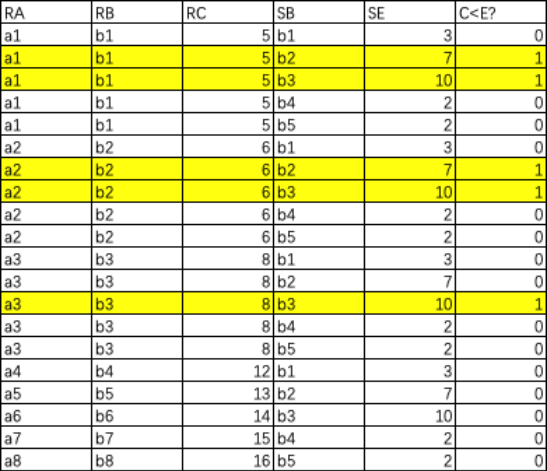

# 传统的集合运算

### 1. 并

   $R \cup S$

### 2. 交

   $R \cap S$

### 3. 差

   $R - S$

### 4. 笛卡尔积

   $R \times S$​

#### 4.1 域

域是一组具有相同数据类型的值的集合, 例如: { 李明, 张三 , 王五} , { 男, 女 } , { 计算机 , 旅游管理 } 

#### 4.2 笛卡尔积

笛卡尔积是域上的集合运算, 允许某些域上是相同的

按域的顺序, 每个域任取一个值, 列出所有的组合, 就是笛卡尔积

$D_1\times D_2\times \cdot\cdot\cdot D_n=\{(d_1,d_2\cdot \cdot \cdot d_n)|d_i\in D_i,\ i=1,2,\ \cdot\cdot\cdot \ ,n\}$

| 姓名 | 性别 | 专业     |
| ---- | ---- | -------- |
| 李明 | 男   | 计算机   |
| 李明 | 男   | 旅游管理 |
| 李明 | 女   | 计算机   |
| 李明 | 女   | 旅游管理 |
| 张三 | 男   | 计算机   |
| 张三 | 男   | 旅游管理 |
| 张三 | 女   | 计算机   |
| 张三 | 女   | 旅游管理 |
| 王五 | 男   | 计算机   |
| 王五 | 男   | 旅游管理 |
| 王五 | 女   | 计算机   |
| 王五 | 女   | 旅游管理 |

## 专门的关系运算符

### 前置知识

#### 关系模式

表示一张表的首行信息，是一个关系的抽象，例如：$关系模式：R(A_1, A_2,...,A_n)$，$A_1, A_2,...,A_n$ 是属性抽象

比如下图表的第一行:

#### 关系

一张表代表一个关系，n 目，表示 n 列，例如：$R_n$ , 上面的图表就是一个 5 目关系

#### 属性

表内的首行的每个元素叫属性，一个属性对应一列，从第二行开始，下面的都是属性的具体数值

例如: 属性集合 $A=\{(A_{i1}, A_{i2},...,A_{ik})，i\in[1,n]\},\ i\ 是行数,k\ 是列数$，这表示第 $i$ 行的每列的分量集合，叫做属性组（属性列）。

$\overline{A}$ 表示取反，也就是除去第 i 行的其他属性组 ( 集合 ) , 其实就是集合取反

#### 元组

表内的一行叫关系的一个元组

例如：$t\in R$，$t[A_i]$ 表示 t 元组中的 $A_i$ 分量，也就是属性 $A$ 的第 $i$ 行

Student 表的 元组一共有 4 个 ( 不包含第一行, 也就是不包含关系模式 )
$$
t[Sname_2]=刘晨
$$
$t[A] = (t[A_{i1}], t[A_{i2}], ..., t[A_{ik}])$ 表示元组 $t$ 在属性列 $A$ 上各分量的集合

#### 元组连接

$\{\overset{\LARGE{\frown}}{t_rt_s}\ ,\ t_r\in R_n\ , t_s\in S_m\}$ 

成为元组连接，形成一个 $n+m$ 列的元组，前 $n$ 个分量为 $R$ 中的一个 $n$ 元组，也就是 $n$ 列，前 $m$ 个分量为 $S$ 中的一个 $m$ 元组，也就是 $m$ 列。

其实就是把两个元组直接拼到一起

例如将李勇和刘晨这两个元组进行连接:

连接还有一些其他的形式: 等值连接, 非等值连接, 自然连接……后面会说到

#### 象集

关系 $R(X, Y)$ , $X$ 和 $Y$ 为属性组。当 $t[X]=x$ 时，$x$ 在 $R$ 中的象集（images set）为：$Y_x=\{\ t[Y]\ |\ t\in R\ , t[X]=x\ \}$ 

下图是 $t[Y]=2$ , $y$ 在 $R$ 中的象集：

如果你看了后面的计算，那么象集你可以直接用选择加投影来计算象集，比如图中的就是先选择 Y=2 再做 x 的投影

### 选择

   $\sigma _F\left(R\right)$ 表示在 R 中选出符合条件 $F$ 的元组(也就是行)

$$
\sigma _F\left(R\right)=\{t\in R \and F(t)='真'\}
$$

   查询所在系为 $IS$ 的学生，则 $\sigma _{Sdept=CS} \left(Student\right)$ 结果如图所示

   

   查询年龄小于 20 的学生，则  $\sigma _{Sage<20} \left(Student\right)$ 结果如图所示

   

### 投影

   $\Pi _A \left(R\right)$ 表示关系 $R$ 上 $A$ 的投影，是 $R$ 中对应若干属性列组成新的关系 (A 是属性列) , 是只对应属性 A 的集合。

   在 $Student$ 中查询姓名与所在系的关系，$\Pi _{Sname,Sdept} \left(Student\right)$ 结果如图所示

   

### 连接

连接也称 $\theta$ 连接. 他是从两个关系的笛卡尔积中选取属性间满足一定条件的元组
$$
R \substack{\Join \\ A\theta B} S=\{\overset{\LARGE{\frown}}{t_rt_s}\ |\ t_r\in R \and t_s\in S\and t_r[A]\theta t_s[B]\}
$$
$A\theta B$ 是条件,  $A$ 和 $B$ 分别为 $R$ 和 $S$ 上列数相等且可比的属性组, $\theta$ 是比较运算符. 

连接运算从 $R$ 和 $S$ 的笛卡尔积 $R\times S$ 中 , 选取 $R$ 关系在 $A$ 属性组上的值 与 $S$ 关系在 $B$ 属性组上的值 满足比较关系 $\theta$ 的元组

#### 等值连接

$\theta$ 为 $=$ 的连接运算称为等值连接

#### 非等值连接、等值连接、自然连接

自然连接是一种特殊的等值连接。它要求两个关系中进行比较的分量必须是同名的属性组，并且在结果中把重复的属性列去掉。

如图就是非等值连接，等值连接，自然连接的对比

可以看到，

* 非等值连接是符合 $C<E$ 的笛卡尔积元组，

* $R\substack{\Join \\ R.B=S.B}S$ 是符合 $R.B=S.B$ 的等值连接，

* 自然连接要求进行比较的属性 ( 分量 ) 必须是同名的属性组, 并且在结果中把重复的属性组列去掉

  也就是将同属性的两列合并成一列

举一个 **非等值连接** 的计算过程 , 如图是笛卡尔积 , 黄色的是满足 $C<E$ 的

#### 外连接

做自然连接的时候，会有一些不满足条件的元组被舍弃，叫 悬浮元组。

* $R\ ⟗\ S$，外连接是保留（不舍弃）悬浮元组的连接
* $R\ ⟕\ S$，左外连接是保留左边关系的悬浮元组的连接
* $R\ ⟖\ S$，右外连接是保留右边关系的悬浮元组的连接

在下图可以看到，

$R$ 中 $a_2$ $b_4$ $12$ 没有对应的 $E$ 值，所以填 $NULL$

同样，$S$ 中 $b_5$ 也没有对应的 $A$ 和 $E$ 值，也填 $NULL$

### 除运算

$T=R\div S$ 表示 关系 $T$ 是 关系 $R$ 除以 关系 $S$ 的结果（商）

$T$ 包含所有在 $R$ 但不在 $S$ 中的属性及其值， 且 $T$ 的元组与 $S$ 的元组的所有都在 $R$​ 中, 也就是 $S$ 和 $T$ 的组合都是 $R$ 的子集。（所以这个有排除的意思, 更像减法）

给定关系 $R(X,Y)$ 和 $S(Y,Z)$ , 其中 $X,Y,Z$ 为属性组, R 中的 Y 和 S 中的 Y 可以有不同的属性名, 但必须出自相同的域集 ( 也就是有相同的类型 )

我们看这个式子，给定关系 $R(X, Y)$ 和 $S(Y, Z)$

* $R\div S$ 的结果是一个集合, 集合里的元素是 $t_r[X]$ 也就是 属性 $X$ 的一个分量

* $t_r\in R$ 表示元组属于关系 $R$ , 表示 新关系 $T$ 是 $R$ 的子集 ( 集合里的元素是元组 )

* $\Pi _Y(S) \subseteq Y_x$ 表示 关系 $S$ 中的 $Y$ 属性, 应该在 $x$ 在 $R$ 中的象集里

  象集 $Y_x$ 是为了逐一比较, 不同 $x$ 下的 $Y$ 是否包含 $S$ 中 $Y$ 的投影

举例: 下图可以看到，只有 $R$ 中的 $a_1$ $b_1$ $c_2$，$a_1$ $b_2$ $c_3$，$a_1$ $b_2$ $c_1$

* 首先看，包含在 $R$ 但是不包含在 $S$ 的属性显然是属性 $A$，所以我们求解的答案肯定是一个 $A$ 分量 的列

* 其次，求出 $A$ 的所有值对应的象集，也就是 $a_1, a_2,a_3,a_4$ 的象集

  各象集

  $BC_{a_1}=\{(b_1,c_1),(b_3,c_7),(b_2,c_1)\}$

  $BC_{a_2}=\{(b_3,c_7),(b_2,c_3)\}$

  $BC_{a_3}=\{(b_4,c_6)\}$

  $BC_{a_4}=\{(b_6,c_6)\}$​

* 求出 $S$ 中 $BC$ 的投影

  $\Pi_{BC}(S)=\{(b_1,c_2),(b_2,c_1),(b_2,c_3)\}$

* 然后确定包含关系，发现只有 $a_1$ 包含 $S$ 中的 $BC$ 所有组合

* 答案就是 $a_1$

  
