## 中间三个

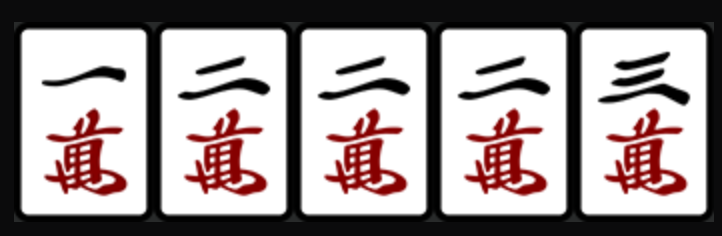

> 可以看做 123+22

## 中间两对

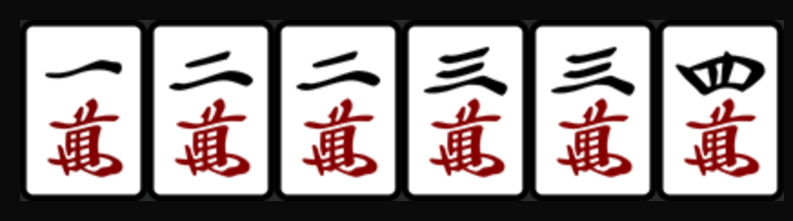

> 可以看做 123+234

### 变化一: 加单牌

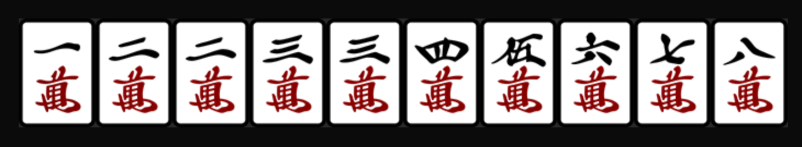

> 此时可胡 二万, 五万, 八万
>
> 五万, 八万 很好理解, 相当于, 122334+一对+一顺
>
> 来二万, 组成 22+123+345+678
>
> 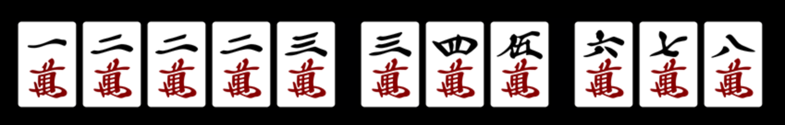

### 变化二: 中间缺一张

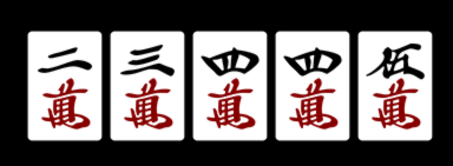

> 此时看似是 234+45 等一张 6
>
> 其实等 3 组成 234+345 也可以

## 中间三对

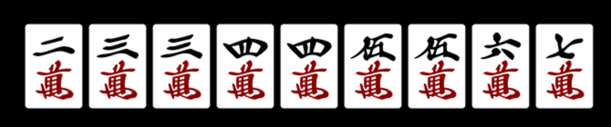

> 中间三对有别于中间两对, 需要额外一张来形成连顺: 234+345+567
>
> 这其实和下面说的 232 牌型是差不多的
>
> 假设没有单牌
>
> 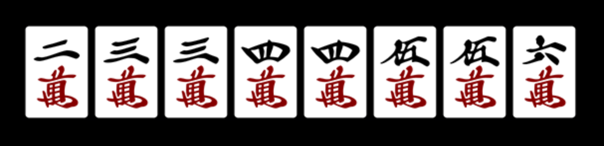
>
> 此时为两个顺子, 我们可以等哪些牌?
>
> * 可以等 1, 形成 123+345+456 多一个三张
>
>   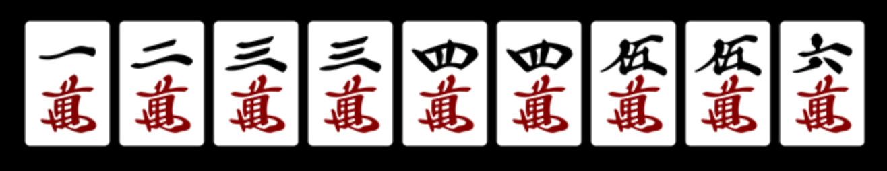
>
> * 可以等 2, 形成 22+345+345(456) 多一个对子, 打掉一张 3 或者 6
>
>   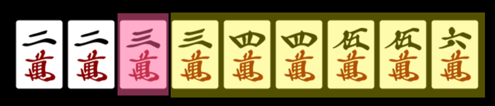
>
>   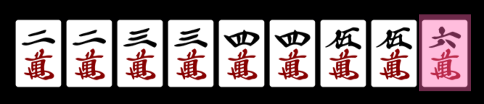
>
>   **这里形成的是 4 连对**
>
> * 可以等 3, 形成 234+33+456 或者 33+345+456 多一个对子, 打掉 5 或者 2
>
>   
>
>   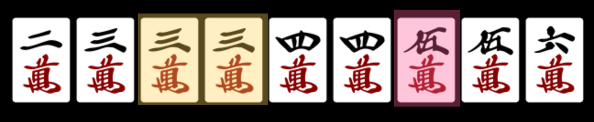
>
> * 可以等 4,形成 234+345+456 多一个三张
>
>   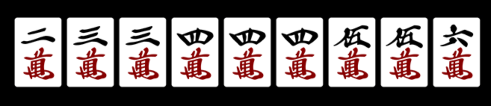
>
> * 可以等 5, 类比等 3 , 形成 234+345+55 或者 234+44+456 多一个对子, 打掉 6 或者 3
>
>   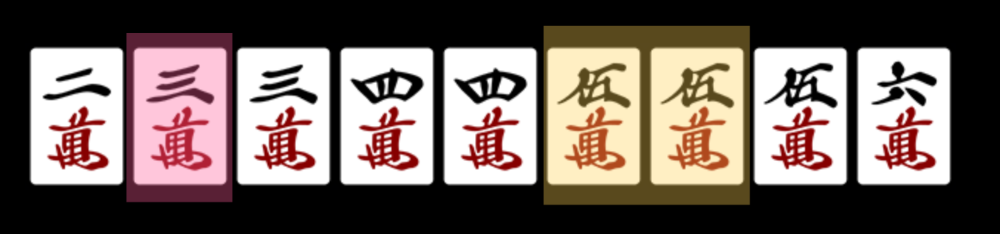
>
>   
>
> * 可以等 6, 类比等 2, 形成 234(345)+345+66 多一个对子, 打掉 5 或者 2
>
>   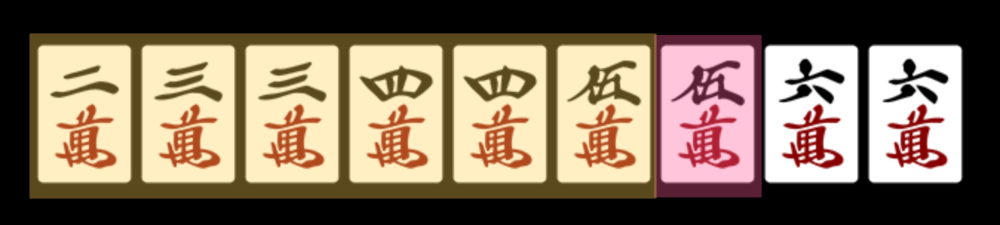
>
>   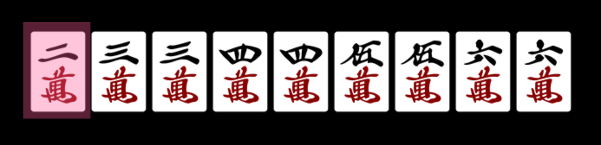
>
>   **这里形成的是 4 连对**

## 232 牌型

可看做 123+234+345

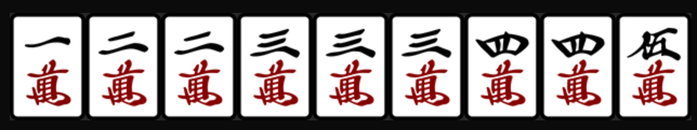

## 双边 3 ( 九莲宝灯 )

此时来任意一张万牌都能赢 

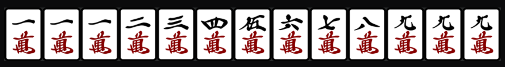

如果来一万 , 111+123+456+789+99

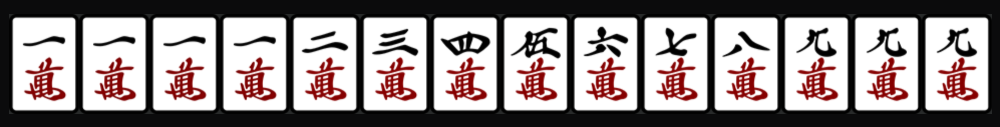

如果来二万 , 111+22+345+678+999

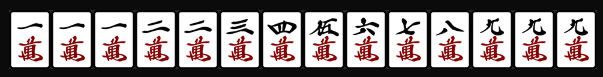

如果来三万 , 11+123+345+678+999

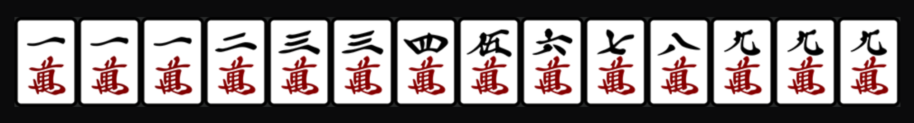

如果来四万 , 111+234+456+789+99

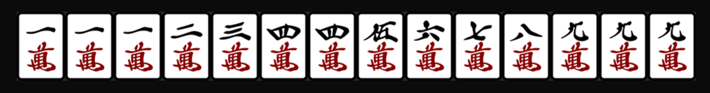

以此类推……